Introduction to Kalman-Filter
================

  - [Introduction](#introduction)
  - [The state-space model](#the-state-space-model)
  - [Matrix Algebra](#matrix-algebra)
      - [Matrix Inversion](#matrix-inversion)
  - [Kalman Filter](#kalman-filter)
      - [Prediction Step](#prediction-step)
      - [Update](#update)
      - [Algorithm](#algorithm)
      - [Recursive Regression Models](#recursive-regression-models)
  - [Extended-Kalman-Filter](#extended-kalman-filter)
      - [Prediction](#prediction)
      - [Update](#update-1)
      - [Algorithm](#algorithm-1)
      - [Simulation](#simulation)
  - [Particle Filter](#particle-filter)
      - [Importance Sampling](#importance-sampling)
      - [Example](#example)
      - [Sequential Importance
        Sampling](#sequential-importance-sampling)
      - [Sequential Importance
        Resampling](#sequential-importance-resampling)
      - [Particle-Filter Example](#particle-filter-example)
  - [Conclusio](#conclusio)

# Introduction

Bayesian filtering provides a framework to solve linear and non-linear
stochastic systems. Due to their flexible nature, bayesian filtering
methods are being implemented in various fields such as economics,
robotics and biology amongst others. Using the baysian approach allows
the estimation problem to be solved in a recursive manner. Consequently,
a model is able to update it’s parameters with each new observation. The
ability to monitor the developement of the state of a system is a key
advantage of bayesian filtering methods over other methods such as
classical linear regression.

Bayesian filtering refers to a broad class of methods. There are several
different bayesian filtering methods which can broadly be devided into
gaussian and non gaussian methods. A model is classified as gaussian,
when any finite number of linear combinations of random variables
follows a multivariate normal distribution. Here we considere two
gaussian methods, the Kalman-Filter, the Extended-Kalman-Filter and the
Particle-Filter, which is a non gaussian method.

Bayesian filters originate in optimal control theory. Thus historically
the control theory notation has been used to describe Bayesian filtering
models, which is divergent from other fields. The above mentioned models
are generally referred to as state-space models. The state is set of
unknown parameters of which the system depends, and the state-space is
the set of all possible values the state can have. The model describes
the relationship between unobserved states and observed measurements.

This presentation is structured as following: section 2 presents the key
derivations of the state-space model equations. Section three revisits
matrix algebra followed and section four the properties of the
multivariate gaussian distribution. The matrix algebra and the
multivariate gaussian distribution are essential in deriving the
Kalman-Filter equations, which are presented in section five. In section
six the key equations and their derivations of the
Extended-Kalman-Filter are presented. Finally, section seven presents an
introduction to the Particel-Filter. The paper ends with a short
conclusion that summarizes the main ideas of this paper.

# The state-space model

where the state
 is assumed to have the Markov property, meaning that no
other dependencies than the ones specified above exist. The variable
 is the variable of interest, also referred to as the
observation or measurement. For the purpose of conducting inference on
the state using measurements, the quantity of interest is the posterior
distribution if the current state, given all measurements
:

The process of calculating these quantities begins with the assumption
that the previous value
") is known. Then using the fact
that:

where  = p(\\textbf{x}_{t}|\\textbf{x}_{t-1})")
by assuming the Markov property holds. This equality decomposes the
problem of calculating the probability of observing past and current
state conditional on previous measurements into a part which is assumed
to be known ") and one for which there is
a model
"). The next step is called
prediction and consists of calculating:

because  = p(\\textbf{x}_{t}|\\textbf{x}_{t-1}) p(\\textbf{x}_{t-1} |\\textbf{y}_{1:t-1})")
(Kolmogorov-Chapman equation) and the fact for two random variables
 and for an arbitrary density function
: 

With new measurements
 being observed, using the Bayes’ theorem and the fact
that  = p(\\textbf{y}_t, \\textbf{y}_{1:t-1})") the
quantity
") and can be reformulated as:

# Matrix Algebra

## Matrix Inversion

This section presents matrix lemmas that are helpful in deriving the
equations for the Kalman-Filter equations. Let , ,  and  and:

  
  

such that:

  
  

then assuming
 and
 are invertible:   
^{-1} \\\\
        H &= (D - CA^{-1}B)^{-1} \\\\
    \\end{aligned}
\\end{equation*}
")  

and

  
^{-1}BD^{-1} = - A^{-1}B(D - CA^{-1}B)^{-1} \\\\
        G &= - (D - CA^{-1}B)^{-1}CA^{-1} = - D^{-1}C(A - BD^{-1}C)^{-1} \\\\
    \\end{aligned}
\\end{equation*}
")  

and

  
^{-1} &= A^{-1} + A^{-1}B(D - CA^{-1}B)^{-1}CA^{-1} \\\\
        (D - CA^{-1}B)^{-1} &= D^{-1} + D^{-1}C(A - BD^{-1}C)^{-1}BD^{-1} \\\\
    \\end{aligned}
\\end{equation*}
")  
\#\# Matrix Decomposition Given the previous assumptions:   
![&#10;\\begin{equation\*}&#10; \\begin{aligned} M = &#10;
\\begin{pmatrix}&#10; A & B \\\\ &#10; C & D \\\\ &#10; \\end{pmatrix}
&= &#10; \\begin{pmatrix}&#10; I & B \\\\ &#10; O & D \\\\ &#10;
\\end{pmatrix} \\begin{pmatrix}&#10; A - BD^{-1}C & O \\\\ &#10; D^{-1}C
& I \\\\ &#10; \\end{pmatrix} \\\\&#10; &= \\begin{pmatrix}&#10; A & O
\\\\ &#10; C & I \\\\ &#10; \\end{pmatrix} \\begin{pmatrix}&#10; I &
A^{-1}B \\\\ &#10; O & D - CA^{-1}B \\\\ &#10; \\end{pmatrix} &#10;
\\end{aligned}&#10;\\end{equation\*}&#10;](https://latex.codecogs.com/png.image?%5Cdpi%7B110%7D&space;%5Cbg_white&space;%0A%5Cbegin%7Bequation%2A%7D%0A%20%20%20%20%5Cbegin%7Baligned%7D%20M%20%3D%20%0A%20%20%20%20%20%20%20%20%5Cbegin%7Bpmatrix%7D%0A%20%20%20%20%20%20%20%20%20%20%20%20A%20%26%20B%20%5C%5C%20%0A%20%20%20%20%20%20%20%20%20%20%20%20C%20%26%20D%20%5C%5C%20%0A%20%20%20%20%20%20%20%20%5Cend%7Bpmatrix%7D%20%26%3D%20%0A%20%20%20%20%20%20%20%20%5Cbegin%7Bpmatrix%7D%0A%20%20%20%20%20%20%20%20%20%20%20%20I%20%26%20B%20%5C%5C%20%0A%20%20%20%20%20%20%20%20%20%20%20%20O%20%26%20D%20%5C%5C%20%0A%20%20%20%20%20%20%20%20%5Cend%7Bpmatrix%7D%20%5Cbegin%7Bpmatrix%7D%0A%20%20%20%20%20%20%20%20%20%20%20%20A%20-%20BD%5E%7B-1%7DC%20%26%20O%20%5C%5C%20%0A%20%20%20%20%20%20%20%20%20%20%20%20D%5E%7B-1%7DC%20%26%20I%20%5C%5C%20%20%20%20%20%20%20%20%20%20%20%20%20%0A%20%20%20%20%20%20%20%20%5Cend%7Bpmatrix%7D%20%5C%5C%0A%20%20%20%20%20%20%20%20%26%3D%20%5Cbegin%7Bpmatrix%7D%0A%20%20%20%20%20%20%20%20%20%20%20%20A%20%26%20O%20%5C%5C%20%0A%20%20%20%20%20%20%20%20%20%20%20%20C%20%26%20I%20%5C%5C%20%0A%20%20%20%20%20%20%20%20%5Cend%7Bpmatrix%7D%20%5Cbegin%7Bpmatrix%7D%0A%20%20%20%20%20%20%20%20%20%20%20%20I%20%26%20A%5E%7B-1%7DB%20%5C%5C%20%0A%20%20%20%20%20%20%20%20%20%20%20%20O%20%26%20D%20-%20CA%5E%7B-1%7DB%20%5C%5C%20%20%20%20%20%20%20%20%20%20%20%20%20%0A%20%20%20%20%20%20%20%20%5Cend%7Bpmatrix%7D%20%0A%20%20%20%20%5Cend%7Baligned%7D%0A%5Cend%7Bequation%2A%7D%0A
"
\\begin{equation*}
    \\begin{aligned} M = 
        \\begin{pmatrix}
            A & B \\\\ 
            C & D \\\\ 
        \\end{pmatrix} &= 
        \\begin{pmatrix}
            I & B \\\\ 
            O & D \\\\ 
        \\end{pmatrix} \\begin{pmatrix}
            A - BD^{-1}C & O \\\\ 
            D^{-1}C & I \\\\             
        \\end{pmatrix} \\\\
        &= \\begin{pmatrix}
            A & O \\\\ 
            C & I \\\\ 
        \\end{pmatrix} \\begin{pmatrix}
            I & A^{-1}B \\\\ 
            O & D - CA^{-1}B \\\\             
        \\end{pmatrix} 
    \\end{aligned}
\\end{equation*}
")  

It follows that:   
|  &= |det(D)||det(A - BD^{-1}C)| \\\\
                &= |det(A)||det(D - CA^{-1}B)|
    \\end{aligned}
\\end{equation*}
")  
\# Gaussian Distribution

In the following key properties of the gaussian distribution will be
presented.

A random variable  is following a gaussian distribution if, its
density is defined as:   
 = \\frac{1}{\\sqrt{2\\pi}} exp(-\\frac{z^2}{2})
\\end{equation*}
")  

and the joint density of identical, independently distributed (iid)
gaussians is:   
 &= \\prod_{i=1}^n \\frac{1}{\\sqrt{2\\pi}} exp(-\\frac{z_i^2}{2}) \\\\
                      &= (2\\pi)^{-\\frac{n}{2}}exp(-\\frac{\\sum_{i=1}^nz^2}{2}) \\\\
                      &= (2\\pi)^{-\\frac{n}{2}}exp(-\\frac{\\textbf{(z - 0)}^T \\textbf{I}_n \\textbf{(z - 0)}}{2}) 
    \\end{aligned}
\\end{equation*}
")  

which is the product density and thus itself a density (without proof)
and will be referred to as a multivariate gaussian distribution with
 mean and
 as the covariance matrix, in short:

  
 \\sim \\mathcal{N}(\\textbf{0}, \\textbf{I}_n)
\\end{equation*}
")  

The multivariate gaussian has the property that linear transformations
follow again a multivariate gaussian distribution. The proof of this
theorem requires the transformation theorem for integrals and the
diagonalization of symmetric matrices theorem.

If , ,  \\sim \\mathcal{N}(\\textbf{0}, \\textbf{I}_n)"),
, \\mu_i \\in \\mathbb{R}") and
 then:   

\\end{equation*} 
")  

Thus
 follows a multivariate gaussian distribution with mean
 and covariance
.

Following the exact same reasoning and under the same assumptions as
previously and if  with  then:

  

\\end{equation*}
")  

This equation will be referred to as the reproductive property of the
multivariate gaussian distribution. The key takeaway from this section
is that linear transformations of multivariate gaussian distributions
are themselves multivariate gaussian distributed.

Under the same assumptions as in Lemma 4.1 and if ") and "), then:   
, (\\Sigma_X - \\Sigma_{X,Y}\\Sigma_Y^{-1}\\Sigma_{Y,X})) \\\\
        Y|X \\sim \\mathcal{N}(\\mu_Y + \\Sigma_{X,Y}^T\\Sigma_X^{-1}(\\textbf{x}-\\mu_X), (\\Sigma_Y - \\Sigma_{Y,X}\\Sigma_X^{-1}\\Sigma_{X,Y})) 
    \\end{aligned}
\\end{equation*}
")  
These distribution can be derived from the matrix inversion lemma and
the Woodbury formula. These conditional posterior distributions are the
basis for the Kalman-Filter.

# Kalman Filter

The Kalman-Filter is a method to estimate dynamic linear systems with
gaussian noise. Gaussian noise can be additive or take other functional
forms. In this analysis we are only considering the case for additive
noise. The system is assumed to take the following form:

  
 \\\\
        \\textbf{y}_t &= \\textbf{H}_t\\textbf{x}_t + \\textbf{r}_t, \\ \\textbf{r}_t \\sim \\mathcal{N}(\\textbf{0},\\textbf{R}_{t})          
    \\end{aligned}
\\end{equation*}
")  

where  is the state and  is the measurement. This equation
describes the state and process dynamics. The transition between the
current and past state is captured through
 and the relation between the current state and the
measurement is captured by
, where
 is the measurement noise. Both
 and
 are assumed to be independent.

## Prediction Step

For the purpose of solving the baysian filtering problem, we are
interested in calculating first
"), which we can calculate directly
using the reproductive property of the gaussian distribution. Assuming:
"):

  
  

then:   
 \\\\
\\end{aligned}
\\end{equation}
")  

This step is also referred to as the “prediction step”.

## Update

Next we calculate ") by applying the
reproductive property again and obtain:

  
 \\\\
    \\end{aligned}
\\end{equation}
")  

To calculate
"), we first calculate the joint
distribution "):

  
![&#10;\\begin{equation} &#10; \\begin{aligned} &#10; \\textbf{x}\_t,
\\textbf{y}\_t|\\textbf{y}\_{1:t-1} &\\sim \\mathcal{N}&#10;
\\begin{pmatrix}&#10; \\begin{pmatrix}&#10; \\textbf{m}\_t \\\\&#10;
\\textbf{H}\_{t}\\textbf{m}\_t&#10; \\end{pmatrix}, &#10;
\\begin{pmatrix}&#10; \\textbf{C}\_t & \\textbf{C}\_t\\textbf{H}\_{t}^T
\\\\&#10; \\textbf{H}\_{t}\\textbf{C}\_t^T &
\\textbf{H}\_t\\textbf{C}\_t\\textbf{H}\_t^T + \\textbf{R}\_{t}&#10;
\\end{pmatrix}&#10; \\end{pmatrix}&#10;
\\end{aligned}&#10;\\end{equation}&#10;](https://latex.codecogs.com/png.image?%5Cdpi%7B110%7D&space;%5Cbg_white&space;%0A%5Cbegin%7Bequation%7D%20%0A%20%20%20%20%5Cbegin%7Baligned%7D%20%0A%20%20%20%20%20%20%20%20%5Ctextbf%7Bx%7D_t%2C%20%5Ctextbf%7By%7D_t%7C%5Ctextbf%7By%7D_%7B1%3At-1%7D%20%26%5Csim%20%5Cmathcal%7BN%7D%0A%20%20%20%20%20%20%20%20%5Cbegin%7Bpmatrix%7D%0A%20%20%20%20%20%20%20%20%20%20%20%20%5Cbegin%7Bpmatrix%7D%0A%20%20%20%20%20%20%20%20%20%20%20%20%20%20%20%20%5Ctextbf%7Bm%7D_t%20%5C%5C%0A%20%20%20%20%20%20%20%20%20%20%20%20%20%20%20%20%5Ctextbf%7BH%7D_%7Bt%7D%5Ctextbf%7Bm%7D_t%0A%20%20%20%20%20%20%20%20%20%20%20%20%5Cend%7Bpmatrix%7D%2C%20%0A%20%20%20%20%20%20%20%20%20%20%20%20%5Cbegin%7Bpmatrix%7D%0A%20%20%20%20%20%20%20%20%20%20%20%20%20%20%20%20%5Ctextbf%7BC%7D_t%20%26%20%5Ctextbf%7BC%7D_t%5Ctextbf%7BH%7D_%7Bt%7D%5ET%20%5C%5C%0A%20%20%20%20%20%20%20%20%20%20%20%20%20%20%20%20%5Ctextbf%7BH%7D_%7Bt%7D%5Ctextbf%7BC%7D_t%5ET%20%26%20%5Ctextbf%7BH%7D_t%5Ctextbf%7BC%7D_t%5Ctextbf%7BH%7D_t%5ET%20%2B%20%5Ctextbf%7BR%7D_%7Bt%7D%0A%20%20%20%20%20%20%20%20%20%20%20%20%5Cend%7Bpmatrix%7D%0A%20%20%20%20%20%20%20%20%5Cend%7Bpmatrix%7D%0A%20%20%20%20%5Cend%7Baligned%7D%0A%5Cend%7Bequation%7D%0A
"
\\begin{equation} 
    \\begin{aligned} 
        \\textbf{x}_t, \\textbf{y}_t|\\textbf{y}_{1:t-1} &\\sim \\mathcal{N}
        \\begin{pmatrix}
            \\begin{pmatrix}
                \\textbf{m}_t \\\\
                \\textbf{H}_{t}\\textbf{m}_t
            \\end{pmatrix}, 
            \\begin{pmatrix}
                \\textbf{C}_t & \\textbf{C}_t\\textbf{H}_{t}^T \\\\
                \\textbf{H}_{t}\\textbf{C}_t^T & \\textbf{H}_t\\textbf{C}_t\\textbf{H}_t^T + \\textbf{R}_{t}
            \\end{pmatrix}
        \\end{pmatrix}
    \\end{aligned}
\\end{equation}
")  

Where:   
![&#10;\\begin{align\*}&#10; cov(\\textbf{x}\_t,
\\textbf{y}\_t|\\textbf{y}\_{1:t-1}) &= cov(\\textbf{x}\_t,
\\textbf{H}\_t\\textbf{x}\_t + r\_t|\\textbf{y}\_{1:t-1}) \\\\&#10; &=
cov(\\textbf{x}\_t, \\textbf{H}\_t\\textbf{x}\_t|\\textbf{y}\_{1:t-1}) +
cov(\\textbf{x}\_t + r\_t|\\textbf{y}\_{1:t-1}) \\\\&#10; &=
cov(\\textbf{x}\_t, \\textbf{H}\_t\\textbf{x}\_t|\\textbf{y}\_{1:t-1})
\\\\&#10; &=
\\textbf{C}\_t\\textbf{H}\_{t}^T&#10;\\end{align\*}&#10;](https://latex.codecogs.com/png.image?%5Cdpi%7B110%7D&space;%5Cbg_white&space;%0A%5Cbegin%7Balign%2A%7D%0A%20%20%20%20cov%28%5Ctextbf%7Bx%7D_t%2C%20%5Ctextbf%7By%7D_t%7C%5Ctextbf%7By%7D_%7B1%3At-1%7D%29%20%26%3D%20cov%28%5Ctextbf%7Bx%7D_t%2C%20%5Ctextbf%7BH%7D_t%5Ctextbf%7Bx%7D_t%20%2B%20r_t%7C%5Ctextbf%7By%7D_%7B1%3At-1%7D%29%20%5C%5C%0A%20%20%20%20%20%20%20%20%20%20%20%20%20%20%20%20%20%20%20%20%20%20%20%20%20%20%20%20%20%20%20%20%20%20%20%20%20%20%20%20%20%20%20%20%20%20%20%20%20%20%20%20%20%20%20%26%3D%20cov%28%5Ctextbf%7Bx%7D_t%2C%20%5Ctextbf%7BH%7D_t%5Ctextbf%7Bx%7D_t%7C%5Ctextbf%7By%7D_%7B1%3At-1%7D%29%20%2B%20cov%28%5Ctextbf%7Bx%7D_t%20%2B%20r_t%7C%5Ctextbf%7By%7D_%7B1%3At-1%7D%29%20%5C%5C%0A%20%20%20%20%20%20%20%20%20%20%20%20%20%20%20%20%20%20%20%20%20%20%20%20%20%20%20%20%20%20%20%20%20%20%20%20%20%20%20%20%20%20%20%20%20%20%20%20%20%20%20%20%20%20%20%26%3D%20cov%28%5Ctextbf%7Bx%7D_t%2C%20%5Ctextbf%7BH%7D_t%5Ctextbf%7Bx%7D_t%7C%5Ctextbf%7By%7D_%7B1%3At-1%7D%29%20%5C%5C%0A%20%20%20%20%20%20%20%20%20%20%20%20%20%20%20%20%20%20%20%20%20%20%20%20%20%20%20%20%20%20%20%20%20%20%20%20%20%20%20%20%20%20%20%20%20%20%20%20%20%20%20%20%20%20%20%26%3D%20%5Ctextbf%7BC%7D_t%5Ctextbf%7BH%7D_%7Bt%7D%5ET%0A%5Cend%7Balign%2A%7D%0A
"
\\begin{align*}
    cov(\\textbf{x}_t, \\textbf{y}_t|\\textbf{y}_{1:t-1}) &= cov(\\textbf{x}_t, \\textbf{H}_t\\textbf{x}_t + r_t|\\textbf{y}_{1:t-1}) \\\\
                                                       &= cov(\\textbf{x}_t, \\textbf{H}_t\\textbf{x}_t|\\textbf{y}_{1:t-1}) + cov(\\textbf{x}_t + r_t|\\textbf{y}_{1:t-1}) \\\\
                                                       &= cov(\\textbf{x}_t, \\textbf{H}_t\\textbf{x}_t|\\textbf{y}_{1:t-1}) \\\\
                                                       &= \\textbf{C}_t\\textbf{H}_{t}^T
\\end{align*}
")  

where  = 0") due to the
independence between
 and
. Then we obtain:

  
^{-1}(\\textbf{y}_t - \\textbf{H}_{t}\\textbf{m}_t) \\\\
    \\Sigma_t&:= (\\textbf{C}_t - \\textbf{C}_t\\textbf{H}_{t}^T(\\textbf{H}_t\\textbf{C}_t\\textbf{H}_t^T + \\textbf{R}_{t})^{-1}\\textbf{H}_{t} \\\\
\\end{align*}    
")  
and thus:

  
 \\\\
\\end{equation}
")  

Thus we obtained a closed form solution for the linear dynamic
stochastic model.

## Algorithm

To summarize the algorithm:

  - predict:
      - 
      - 
  - update:
      - 
      - 
      - 
      - 
      - 

<!-- end list -->

``` r
# generating samples from the multivariate normal distribution 
mvnorm <- function(n, mu, covar){
    return((t(chol(covar)) %*% rnorm(n)) + mu)
}
#####

#####
# kalman filter equations inplementation
# the implementation is slightly different for vector inputs then matrix inputs
# which is why it requires two different "inner" implementations
kalman_filter <- function(measurements, stateTransition, processNoise,
    outputMatrix, measurementNoise){    

    # vector input 
    if(is.vector(measurements)){

        # number of measurements
        n <- length(measurements)

        # number of states
        n_state <- ncol(stateTransition)

        # init state matrix
        state <- matrix(0, ncol=n_state, nrow=n)

        # use first measurement as init state
        state[1, ] <- c(measurements[1], rep(0, n_state - 1))

        # init state covariance matrix
        S <- diag(rep(10, n_state))

        # kalman filter equations 
        for(i in 2:n){
            # predict
            m_ <- stateTransition %*% state[i-1, ]
            S_ <- stateTransition %*% S %*% t(stateTransition) + processNoise

            # update
            S <- outputMatrix %*% S_ %*% t(outputMatrix) + measurementNoise
            K <- S_ %*% t(outputMatrix) %*% solve(S)
            m <- m_ + K %*% (measurements[i] - outputMatrix %*% m_)
            S <- S_ - K %*% S %*% t(K)

            # save
            state[i,] <- m
        }
    }
    if(is.matrix(measurements)){

        # number of measurements
        n_measure <- nrow(measurements)

        # number of states
        n_state <- ncol(stateTransition)

        # init state 
        state <- matrix(0, ncol=n_state, nrow=n_measure)

        # use first measurement as init state
        state[1, ] <- c(measurements[1,], rep(0, n_state - ncol(measurements)))

        # state covariance matrix
        S <- diag(rep(10, n_state))

        # kalman filter equations
        for(i in 2:n){
            # predict
            m_ <- stateTransition %*% state[i-1, ]
            S_ <- stateTransition %*% S %*% t(stateTransition) + processNoise

            # update
            S <- outputMatrix %*% S_ %*% t(outputMatrix) + measurementNoise
            K <- S_ %*% t(outputMatrix) %*% solve(S)
            m <- m_ + K %*% (measurements[i,] - outputMatrix %*% m_)
            S <- S_ - K %*% S %*% t(K)

            # save
            state[i,] <- m
        }
    }
    # return state  
    return(state)
}
#####

#####
# functions usind in deriving the recursive non linear regression extended kalman-filter solution
# exponential model with one variable
h <- function(x, beta) { exp(x*beta) }

# derivative of the exponential function w.r.t. the state
H <- function(x, beta) { h(x, beta)/x }
#####

#####
# functions for the importance sampling example
# function of the random variable
f <- function(x) {cos(x)^2 }

# normal density
d_norm  <- function(x, mu=0, sig=1) {1/sqrt(2*pi)*exp(- (x-mu)^2/(2*sig^2))}

# laplace distribution density
dlaplace <- function(x, b=1, mu =0){ 1/(2*b)*exp(-abs(x-mu)/b)}

# generate random variables according to the laplace distribution
rlaplace <- function(b, u){
    -b*sign(u-0.5)*log(1 - 2*abs(u-0.5))
}
#####

#####
# state transition function for the particle filter simulation
state_update <- function(x,t) {  0.5*x + 25*x/(1 + x^2) + 8*cos(1.2*(t-1)) }

# measurement / process transition function for the particle filter simulation
measurement_update <- function(x) { x^2/20 }
#####

#####
# state transition function for the particle filter simulation
stochastic_volatility_state  <- function(x, a, b) { a + b * x }

# measurement / process transition function for the particle filter simulation
stochastic_volatility_process  <- function(state) { exp(state) }
#####
```

The following three figures present the results of the Kalman-Filter
estimation of three different stochastic systems. A thourough
statistical performance evaluation will be omitted at this point, and we
are going to limit the evaluation to the visual inspection of the
results. Figure 1 presents a constant model with gaussian noise, which
changes its mean over time. Figure 2 represents sine measurements with
gaussian noise, which is a non-linear stochastic process. Figure 3
depicts a random walk in two dimensions, where movement in either
direction is dependent on the previous position plus gaussian noise.

``` r
# generate n constant measurements whose mean changes after n/2 measurements
# random seed
set.seed(0)

# init n
n <- 1000

# save results
time_var_const_mean <- numeric(n)

# generate time depended constant data with gaussian noise
for(i in 1:n){
        time_var_const_mean[i] <- rnorm(1, mean = 5, sd = 0.1)
    if( i < n/2){
    } else {
        time_var_const_mean[i] <- rnorm(1, mean = 10, sd = 0.1)
    }
}

# apply the kalman filter
kf_const_time_var_mean <- kalman_filter( measurements = time_var_const_mean, stateTransition = matrix(c(1,1, 0,1), ncol = 2), 
    processNoise = diag(rep(1,2)), outputMatrix = matrix(c(1,0), ncol = 2),  measurementNoise = matrix(1, ncol=1)
)

plot(time_var_const_mean, pch=19, 
    main = "Kalman-Filter Mean-Shift Model",
    xlab = "Time",
    ylab = "Measurements")
lines(kf_const_time_var_mean[,1], col='red')
```

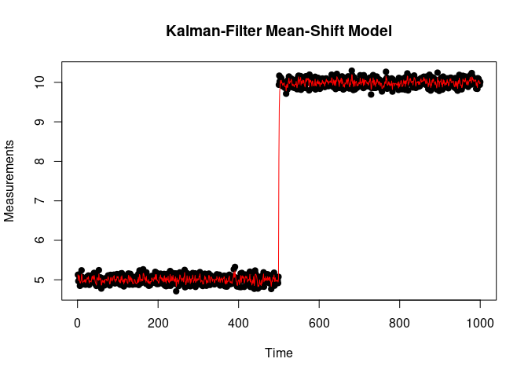

``` r
# second k-f example using sine function with additive gaussian noise 
set.seed(0)

# generate data
sine <- sin(seq(-pi, pi, length.out=n)) + rnorm(n,sd=0.5)

# apply k-f
kf_sine <- kalman_filter(measurements = sine, stateTransition = matrix(c(1,1, 0,1), ncol = 2), processNoise = diag(rep(1,2)), 
    outputMatrix = matrix(c(1,0), ncol = 2), measurementNoise = matrix(1, ncol=1)
)

plot(sine, pch=19, 
    main = "Kalman-Filter Sine Function",
    xlab = "Time",
    ylab = "Measurements")
lines(kf_sine[,1], col='red')
```

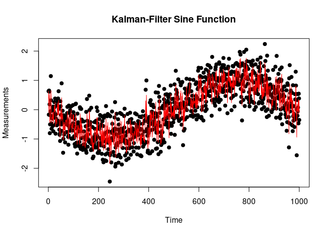

``` r
# generate two dimensional random walk, where the current position depends only on the previous one
set.seed(0)

# save data
random_walk <- matrix(0, ncol=2, nrow=n)

# generte random walk
for(i in 2:n){
    random_walk[i, 1] <- random_walk[i-1, 1] + rnorm(1, sd=0.5)
    random_walk[i, 2] <- random_walk[i-1, 2] + rnorm(1, sd=0.5)
}

# apply k-f
kf_random_walk <- kalman_filter(measurements = random_walk, stateTransition = matrix(c(1,0,0,0, 0,1,0,0, 1,0,1,0, 0,1,0,1), ncol = 4), 
    processNoise = diag(rep(1,4)), outputMatrix = matrix(c(1,0, 0,1, 0,0, 0,0), ncol = 4),  measurementNoise = diag(c(1,1))
)

# save grafics
plot(random_walk, type='l',, 
    main = "Kalman-Filter Random Walk",
    xlab = "X Direction",
    ylab = "Y Direction")
lines(kf_random_walk[,1], kf_random_walk[,2], col='red', lty=2)
```

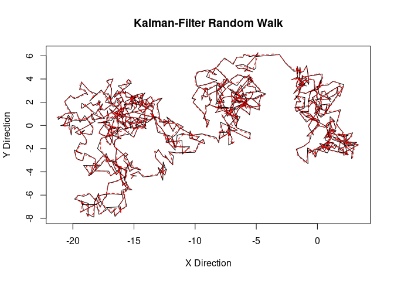

## Recursive Regression Models

The Kalman-Filter can also be used to recursively estimate the state of
a linear regression problem. The recursive solution has the same
posterior distribution as the batch solution, but it allows to monitor
the evolution of the state. In the following we present a simulation to
clarify this point. Using the following model to generate a dependent
variable
 based on the true state ^T") and measurements
:

  

\\end{align*}
")  

and the following state-space representation of the model:

  
^T \\cdot \\beta_t + \\varepsilon_t, \\ \\varepsilon_t \\sim \\mathcal{N}(0,1)
\\end{align*}
")  

The following code generates the respective models.

``` r
# recursive linear regression
set.seed(0)
# explantatory variables with intercept
X <- cbind(rep(1, n), rnorm(n))

# true state
beta <- c(2, 6)

# gaussian model
y_lin <- rnorm(n, mean= X%*%beta, 1)

# save state
beta_lin_est  <- matrix(0, ncol=n, nrow=2)

# state covariance
Sig <- diag(c(1,1))

# not using the kalman filter function because for recursive regression
# the predict step is not required, thus there is no state transition in this model
# run the equations
for(i in 2:n){
    S  <- X[i,,drop=FALSE] %*% Sig %*% t(X[i,,drop=FALSE]) + 1
    K  <- Sig %*% t(X[i,,drop=FALSE]) / as.numeric(S)
    beta_lin_est[,i]  <- beta_lin_est[,i-1] + K %*% (y_lin[i] - X[i, ] %*% beta_lin_est[,i-1])    
    Sig <- Sig - K%*%S%*%t(K)
}

# save plot
plot(X[,2], y_lin,
    main = "Measurement-Space",
    xlab = "X",
    ylab = "y"
)
abline(lm(y_lin ~ X - 1 )$coefficients[1], lm(y_lin ~ X - 1 )$coefficients[2], lw=5)
abline(beta_lin_est[1, n], beta_lin_est[2,n], col = "red")
```

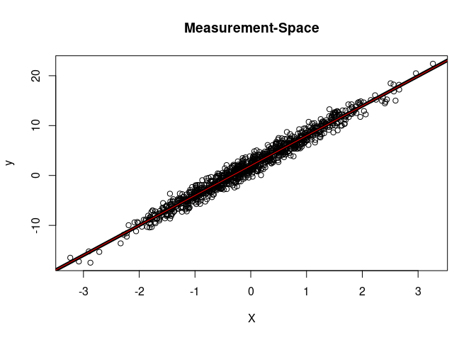

``` r
# state space
plot(beta_lin_est[1,-1], beta_lin_est[2,-1], 
    main = "State-Space Evolution",
    xlab = "Intercept",
    ylab = "x",
    type = "l"
)
points(beta_lin_est[1, 2], beta_lin_est[2,2], pch=19)
text(beta_lin_est[1, 2], beta_lin_est[2,2], "First", adj = c(-0.3, 0.5))
points(beta_lin_est[1, n], beta_lin_est[2,n], pch=19)
text(beta_lin_est[1, n], beta_lin_est[2,n], "Last", adj = c(1.5, 0.5))
abline(v = 2, lty = 2, lw = 0.5, col = "red")
abline(h = 6, lty = 2, lw = 0.5, col = "red")
```

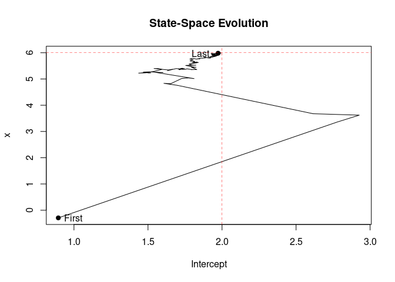

Figure 4 depicts the batch solution as a thick black-, and the recursive
solution as a red line. As we can see, the solutions are practically
identical. Figure 5 depicts the evolution of the state as additional
information becomes available. The red dotted lines represent the true
state. As we can see, the recursive solution moves continuously closer
to the true state.

Concluding, the Kalman-Filter is able to estimate linear- as well as
non-linear time dependent stochastic processes in multiple dimensions.

# Extended-Kalman-Filter

The Kalman-Filter is the solution to a linear dynamic stochastic system.
If the restriction of linearity is dropped, but all other assumptions
maintained, the Bayesian filtering problem can be formulated as:

  
 + \\textbf{q}_{t-1},\\ \\textbf{q}_{t-1} \\sim \\mathcal{N}(\\textbf{0},\\textbf{Q}_{t-1}) \\\\
        \\textbf{y}_t &= \\textbf{g}(\\textbf{x}_t) + \\textbf{r}_t, \\ \\textbf{r}_t \\sim \\mathcal{N}(\\textbf{0},\\textbf{R}_{t})          
    \\end{aligned}
\\end{equation*}
")  

The idea behind the Extended-Kalman-Filter is to calculate an
approximate solution, rather than an exact one. The main tool to achieve
the approximation is the Taylor-Series expansion of
 and
. As with the derivation of the Kalman-Filter equations,
we begin with the prediction step.

## Prediction

According to Taylor’s theorem the first order approximation is:

  
 &\\approx \\textbf{f}(\\textbf{m}_{t-1}) + \\textbf{F}_x(\\textbf{m}_{t-1})(\\textbf{x}_{t-1} - \\textbf{m}_{t-1})  \\\\
    \\end{aligned}
\\end{equation*}
")  

  
 + \\textbf{F}_x(\\textbf{m}_{t-1})(\\textbf{x}_{t-1} - \\textbf{m}_{t-1})\\\\
    \\end{aligned}
\\end{equation*}    
")  

where
 refers to the derivative of
 with respect to
 and
 is assumed to be a known quantity. If we further
assume that  \\sim \\mathcal{N}(\\textbf{0}, \\textbf{C}_{t-1})"),
then using Corollary 4.1 and the model assumptions:

  
, \\textbf{F}_x\\textbf{C}_{t-1}\\textbf{F}_x^T)
\\end{equation*}
")  

and since:

  
![&#10;\\begin{equation\*} &#10; \\begin{aligned}&#10; \\nu\_{t-1} +
\\textbf{q}\_{t-1} &= \\begin{pmatrix}&#10; 1,1&#10;
\\end{pmatrix}^T\\begin{pmatrix}&#10; \\nu\_{t-1} \\\\&#10;
\\textbf{q}\_{t-1}&#10; \\end{pmatrix} \\text{, thus: } \\\\&#10;
\\nu\_{t-1} + \\textbf{q}\_{t-1} &\\sim
\\mathcal{N}\\begin{pmatrix}&#10; \\begin{pmatrix}&#10; 1,1&#10;
\\end{pmatrix}^T \\begin{pmatrix}&#10; \\textbf{f}(\\textbf{m}\_{t-1})
\\\\&#10; \\textbf{0}&#10; \\end{pmatrix}, \\begin{pmatrix}&#10;
\\begin{pmatrix}&#10; 1,1&#10; \\end{pmatrix}^T \\begin{pmatrix}&#10;
\\textbf{F}\_x\\textbf{C}\_{t-1}\\textbf{F}\_x^T & \\textbf{0}\\\\&#10;
\\textbf{0} & \\textbf{Q}\_{t-1}\\\\&#10; \\end{pmatrix}
\\begin{pmatrix}&#10; 1,1&#10; \\end{pmatrix}&#10; \\end{pmatrix}&#10;
\\end{pmatrix} \\\\&#10;
\\end{aligned}&#10;\\end{equation\*}&#10;](https://latex.codecogs.com/png.image?%5Cdpi%7B110%7D&space;%5Cbg_white&space;%0A%5Cbegin%7Bequation%2A%7D%20%0A%20%20%20%20%5Cbegin%7Baligned%7D%0A%20%20%20%20%20%20%20%20%5Cnu_%7Bt-1%7D%20%2B%20%5Ctextbf%7Bq%7D_%7Bt-1%7D%20%26%3D%20%5Cbegin%7Bpmatrix%7D%0A%20%20%20%20%20%20%20%20%20%20%20%201%2C1%0A%20%20%20%20%20%20%20%20%5Cend%7Bpmatrix%7D%5ET%5Cbegin%7Bpmatrix%7D%0A%20%20%20%20%20%20%20%20%20%20%20%20%5Cnu_%7Bt-1%7D%20%5C%5C%0A%20%20%20%20%20%20%20%20%20%20%20%20%5Ctextbf%7Bq%7D_%7Bt-1%7D%0A%20%20%20%20%20%20%20%20%5Cend%7Bpmatrix%7D%20%5Ctext%7B%2C%20thus%3A%20%7D%20%5C%5C%0A%20%20%20%20%20%20%20%20%5Cnu_%7Bt-1%7D%20%2B%20%5Ctextbf%7Bq%7D_%7Bt-1%7D%20%26%5Csim%20%5Cmathcal%7BN%7D%5Cbegin%7Bpmatrix%7D%0A%20%20%20%20%20%20%20%20%20%20%20%20%20%20%20%20%5Cbegin%7Bpmatrix%7D%0A%20%20%20%20%20%20%20%20%20%20%20%20%20%20%20%20%20%20%20%201%2C1%0A%20%20%20%20%20%20%20%20%20%20%20%20%20%20%20%20%5Cend%7Bpmatrix%7D%5ET%20%5Cbegin%7Bpmatrix%7D%0A%20%20%20%20%20%20%20%20%20%20%20%20%20%20%20%20%20%20%20%20%5Ctextbf%7Bf%7D%28%5Ctextbf%7Bm%7D_%7Bt-1%7D%29%20%5C%5C%0A%20%20%20%20%20%20%20%20%20%20%20%20%20%20%20%20%20%20%20%20%5Ctextbf%7B0%7D%0A%20%20%20%20%20%20%20%20%20%20%20%20%20%20%20%20%5Cend%7Bpmatrix%7D%2C%20%5Cbegin%7Bpmatrix%7D%0A%20%20%20%20%20%20%20%20%20%20%20%20%20%20%20%20%20%20%20%20%5Cbegin%7Bpmatrix%7D%0A%20%20%20%20%20%20%20%20%20%20%20%20%20%20%20%20%20%20%20%20%20%20%20%201%2C1%0A%20%20%20%20%20%20%20%20%20%20%20%20%20%20%20%20%20%20%20%20%5Cend%7Bpmatrix%7D%5ET%20%5Cbegin%7Bpmatrix%7D%0A%20%20%20%20%20%20%20%20%20%20%20%20%20%20%20%20%20%20%20%20%20%20%20%20%5Ctextbf%7BF%7D_x%5Ctextbf%7BC%7D_%7Bt-1%7D%5Ctextbf%7BF%7D_x%5ET%20%26%20%5Ctextbf%7B0%7D%5C%5C%0A%20%20%20%20%20%20%20%20%20%20%20%20%20%20%20%20%20%20%20%20%20%20%20%20%5Ctextbf%7B0%7D%20%26%20%5Ctextbf%7BQ%7D_%7Bt-1%7D%5C%5C%0A%20%20%20%20%20%20%20%20%20%20%20%20%20%20%20%20%20%20%20%20%5Cend%7Bpmatrix%7D%20%5Cbegin%7Bpmatrix%7D%0A%20%20%20%20%20%20%20%20%20%20%20%20%20%20%20%20%20%20%20%20%20%20%20%201%2C1%0A%20%20%20%20%20%20%20%20%20%20%20%20%20%20%20%20%20%20%20%20%5Cend%7Bpmatrix%7D%0A%20%20%20%20%20%20%20%20%20%20%20%20%20%20%20%20%5Cend%7Bpmatrix%7D%0A%20%20%20%20%20%20%20%20%5Cend%7Bpmatrix%7D%20%5C%5C%0A%20%20%20%20%5Cend%7Baligned%7D%0A%5Cend%7Bequation%2A%7D%0A
"
\\begin{equation*} 
    \\begin{aligned}
        \\nu_{t-1} + \\textbf{q}_{t-1} &= \\begin{pmatrix}
            1,1
        \\end{pmatrix}^T\\begin{pmatrix}
            \\nu_{t-1} \\\\
            \\textbf{q}_{t-1}
        \\end{pmatrix} \\text{, thus: } \\\\
        \\nu_{t-1} + \\textbf{q}_{t-1} &\\sim \\mathcal{N}\\begin{pmatrix}
                \\begin{pmatrix}
                    1,1
                \\end{pmatrix}^T \\begin{pmatrix}
                    \\textbf{f}(\\textbf{m}_{t-1}) \\\\
                    \\textbf{0}
                \\end{pmatrix}, \\begin{pmatrix}
                    \\begin{pmatrix}
                        1,1
                    \\end{pmatrix}^T \\begin{pmatrix}
                        \\textbf{F}_x\\textbf{C}_{t-1}\\textbf{F}_x^T & \\textbf{0}\\\\
                        \\textbf{0} & \\textbf{Q}_{t-1}\\\\
                    \\end{pmatrix} \\begin{pmatrix}
                        1,1
                    \\end{pmatrix}
                \\end{pmatrix}
        \\end{pmatrix} \\\\
    \\end{aligned}
\\end{equation*}
")  

  
 \\\\
        \\textbf{C}_t & := \\textbf{F}_x\\textbf{C}_{t-1}\\textbf{F}_x^T + \\textbf{Q}_{t-1}\\\\        
    \\end{aligned}
\\end{equation*}
")  

and obtain:   
\\\\
\\end{equation*}
")  

Since :
  
\\\\
        \\textbf{x}_t - \\textbf{m}_{t}|\\textbf{y}_{1:t-1} &\\simeq \\mathcal{N}(\\textbf{0}, \\textbf{C}_t)\\\\
    \\end{aligned}
\\end{equation*}
")  

The distribution of  is derived by
setting  and .

## Update

The derivation for the update equations follows the same arguments as in
the prediction step, by using the information obtained in the prediction
step:

  
 &\\approx \\textbf{g}(\\textbf{m}_{t}) + \\textbf{G}_x(\\textbf{m}_{t})(\\textbf{x}_{t} - \\textbf{m}_{t})  \\\\
    \\end{aligned}
\\end{equation*}
")  

  
 + \\textbf{G}_x(\\textbf{m}_{t})(\\textbf{x}_{t} - \\textbf{m}_{t})
    \\end{aligned}
\\end{equation*}    
")  

Using same arguments as before, we obtain:

  
, \\textbf{G}_x\\textbf{C}_t\\textbf{G}_x^T + \\textbf{R}_t)
\\end{equation*}
")  

and thus the joint distribution "):

  
![&#10;\\begin{equation\*}&#10; \\begin{pmatrix}&#10; \\textbf{x}\_t
\\\\&#10; \\textbf{y}\_t&#10; \\end{pmatrix} \\sim \\mathcal{N}
\\begin{pmatrix}&#10; \\begin{pmatrix}&#10; \\textbf{m}\_t\\\\&#10;
\\textbf{g}(\\textbf{m}\_{t})\\\\&#10; \\end{pmatrix},
\\begin{pmatrix}&#10; \\textbf{C}\_t & \\textbf{C}\_t \\textbf{G}\_x^T
\\\\&#10; \\textbf{G}\_x\\textbf{C}\_t &
\\textbf{G}\_x\\textbf{C}\_t\\textbf{G}\_x^T + \\textbf{R}\_t&#10;
\\end{pmatrix}&#10;
\\end{pmatrix}&#10;\\end{equation\*}&#10;](https://latex.codecogs.com/png.image?%5Cdpi%7B110%7D&space;%5Cbg_white&space;%0A%5Cbegin%7Bequation%2A%7D%0A%20%20%20%20%5Cbegin%7Bpmatrix%7D%0A%20%20%20%20%20%20%20%20%5Ctextbf%7Bx%7D_t%20%5C%5C%0A%20%20%20%20%20%20%20%20%5Ctextbf%7By%7D_t%0A%20%20%20%20%5Cend%7Bpmatrix%7D%20%5Csim%20%5Cmathcal%7BN%7D%20%5Cbegin%7Bpmatrix%7D%0A%20%20%20%20%20%20%20%20%5Cbegin%7Bpmatrix%7D%0A%20%20%20%20%20%20%20%20%20%20%20%20%5Ctextbf%7Bm%7D_t%5C%5C%0A%20%20%20%20%20%20%20%20%20%20%20%20%5Ctextbf%7Bg%7D%28%5Ctextbf%7Bm%7D_%7Bt%7D%29%5C%5C%0A%20%20%20%20%20%20%20%20%5Cend%7Bpmatrix%7D%2C%20%5Cbegin%7Bpmatrix%7D%0A%20%20%20%20%20%20%20%20%20%20%20%20%5Ctextbf%7BC%7D_t%20%26%20%5Ctextbf%7BC%7D_t%20%5Ctextbf%7BG%7D_x%5ET%20%5C%5C%0A%20%20%20%20%20%20%20%20%20%20%20%20%5Ctextbf%7BG%7D_x%5Ctextbf%7BC%7D_t%20%26%20%5Ctextbf%7BG%7D_x%5Ctextbf%7BC%7D_t%5Ctextbf%7BG%7D_x%5ET%20%2B%20%5Ctextbf%7BR%7D_t%0A%20%20%20%20%20%20%20%20%5Cend%7Bpmatrix%7D%0A%20%20%20%20%5Cend%7Bpmatrix%7D%0A%5Cend%7Bequation%2A%7D%0A
"
\\begin{equation*}
    \\begin{pmatrix}
        \\textbf{x}_t \\\\
        \\textbf{y}_t
    \\end{pmatrix} \\sim \\mathcal{N} \\begin{pmatrix}
        \\begin{pmatrix}
            \\textbf{m}_t\\\\
            \\textbf{g}(\\textbf{m}_{t})\\\\
        \\end{pmatrix}, \\begin{pmatrix}
            \\textbf{C}_t & \\textbf{C}_t \\textbf{G}_x^T \\\\
            \\textbf{G}_x\\textbf{C}_t & \\textbf{G}_x\\textbf{C}_t\\textbf{G}_x^T + \\textbf{R}_t
        \\end{pmatrix}
    \\end{pmatrix}
\\end{equation*}
")  

from which we can calculate the distribution of
:

  
![&#10; \\begin{equation\*}&#10; \\begin{aligned}&#10; \\mu\_t &:=
\\textbf{m}\_t + \\textbf{C}\_t
\\textbf{G}\_x^T(\\textbf{G}\_x\\textbf{C}\_t\\textbf{G}\_x^T +
\\textbf{R}\_t)^{-1}(\\textbf{y}\_t - \\textbf{g}(\\textbf{m}\_{t}))
\\\\&#10; \\Sigma\_t &:= \\textbf{C}\_t - \\textbf{C}\_t
\\textbf{G}\_x^T(\\textbf{G}\_x\\textbf{C}\_t\\textbf{G}\_x^T +
\\textbf{R}\_t)^{-1}\\textbf{G}\_x\\textbf{C}\_t\\\\&#10;
\\end{aligned}&#10;
\\end{equation\*}&#10;](https://latex.codecogs.com/png.image?%5Cdpi%7B110%7D&space;%5Cbg_white&space;%0A%20%20%20%20%5Cbegin%7Bequation%2A%7D%0A%20%20%20%20%20%20%20%20%5Cbegin%7Baligned%7D%0A%20%20%20%20%20%20%20%20%20%20%20%20%5Cmu_t%20%26%3A%3D%20%5Ctextbf%7Bm%7D_t%20%2B%20%5Ctextbf%7BC%7D_t%20%5Ctextbf%7BG%7D_x%5ET%28%5Ctextbf%7BG%7D_x%5Ctextbf%7BC%7D_t%5Ctextbf%7BG%7D_x%5ET%20%2B%20%5Ctextbf%7BR%7D_t%29%5E%7B-1%7D%28%5Ctextbf%7By%7D_t%20-%20%5Ctextbf%7Bg%7D%28%5Ctextbf%7Bm%7D_%7Bt%7D%29%29%20%5C%5C%0A%20%20%20%20%20%20%20%20%20%20%20%20%5CSigma_t%20%26%3A%3D%20%20%5Ctextbf%7BC%7D_t%20-%20%5Ctextbf%7BC%7D_t%20%5Ctextbf%7BG%7D_x%5ET%28%5Ctextbf%7BG%7D_x%5Ctextbf%7BC%7D_t%5Ctextbf%7BG%7D_x%5ET%20%2B%20%5Ctextbf%7BR%7D_t%29%5E%7B-1%7D%5Ctextbf%7BG%7D_x%5Ctextbf%7BC%7D_t%5C%5C%0A%20%20%20%20%20%20%20%20%5Cend%7Baligned%7D%0A%20%20%20%20%5Cend%7Bequation%2A%7D%0A
"
    \\begin{equation*}
        \\begin{aligned}
            \\mu_t &:= \\textbf{m}_t + \\textbf{C}_t \\textbf{G}_x^T(\\textbf{G}_x\\textbf{C}_t\\textbf{G}_x^T + \\textbf{R}_t)^{-1}(\\textbf{y}_t - \\textbf{g}(\\textbf{m}_{t})) \\\\
            \\Sigma_t &:=  \\textbf{C}_t - \\textbf{C}_t \\textbf{G}_x^T(\\textbf{G}_x\\textbf{C}_t\\textbf{G}_x^T + \\textbf{R}_t)^{-1}\\textbf{G}_x\\textbf{C}_t\\\\
        \\end{aligned}
    \\end{equation*}
")  
and thus we obtain:

  

\\end{equation*}
")  
Using the first order Taylor series expansion, we obtained a closed form
solution to a non-linear dynamic stochastic system.

## Algorithm

To summarize the algorithm:

  - predict:
      - ")
      - 
  - update:
      - ")
      - 
      - 
      - 
      - 

## Simulation

The Extended-Kalman-Filter can be used to estimate non-linear regression
problems. In this simulation we generated 1000 artificial observations
using:

  
 + \\varepsilon_t, \\ \\varepsilon_t \\sim \\mathcal{N}(0,1)
\\end{align*}
")  
which is a non-linear function of the state, and the following
state-space representation of the model:

  
 + \\varepsilon_t, \\ \\varepsilon_t \\sim \\mathcal{N}(0,1)
\\end{align*}
")  

Figure 6 presents the generated data in black and the result of the
Extended-Kalman-Filter as the red line. As we can see, the
Extended-Kalman-Filter captures the
 relationship for  quite well, and for  appears to consistently underestimate the measurements. Figure
7 shows that the state indeed levels out constantly below the true
state. This divergence might be due to a misspecified model, which we
know is not the case, or due to the fact that large x-values are
unlikely to occur, and there is no evidence to support a proper
estimation of these values.

``` r
##################################################################################################################
############################# EXTENDED KALMAN FILTER SIMULATION  #################################################
##################################################################################################################

# recursive non linear regression
# additional observations
# first try
n <- 1000

# state of the model
beta_non_lin_est  <- numeric(n+1)

# generate covariable, just standard normal observations 
set.seed(0)
x  <- sort(rnorm(n))

# generate gaussian measurements
y_non_lin <- rnorm(n, mean= h(x, 0.9), 1)

# state variance 
Sig <- 1

# run the calculation for the extended kalman filter according to formula
for(i in 1:n){
    v  <- y_non_lin[i] - h(x[i], beta_non_lin_est[i])
    H <- h(x[i], beta_non_lin_est[i])/x[i]
    S  <- H * Sig * H + 1
    K  <- Sig * H / as.numeric(S)
    beta_non_lin_est[1+i]  <- beta_non_lin_est[i] + K * v
    Sig <- Sig - K*S*t(K)
}

# save grafics
plot(x, y_non_lin, 
    main = "Measurements",
    xlab = "x",
    ylab = "y"
)
lines(x, h(x, beta_non_lin_est[-n]), col='red')
```

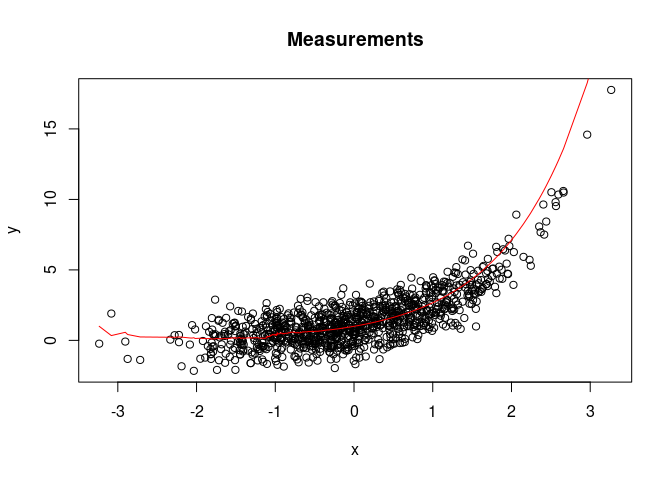

``` r
plot(beta_non_lin_est, type='l',
 main = "State-Space",
 xlab = "Iteration",
 ylab = "State"
)
abline(h = 0.9, col = 'red', lty = 2)
```

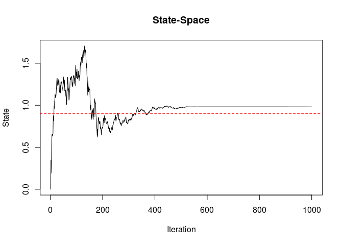

The latter assumption can be tested by increasing the number of
observations generated to 10000:

``` r
# recursive non linear regression
# additional observations
# second try increase n
n <- 10000

# state of the model
beta_non_lin_est  <- numeric(n+1)

# generate covariable, just standard normal observations 
set.seed(0)
x  <- sort(rnorm(n))

# generate gaussian measurements
y_non_lin <- rnorm(n, mean= h(x, 0.9), 1)

# state variance 
Sig <- 1

# run the calculation for the extended kalman filter according to formula
for(i in 1:n){
    v  <- y_non_lin[i] - h(x[i], beta_non_lin_est[i])
    H <- h(x[i], beta_non_lin_est[i])/x[i]
    S  <- H * Sig * H + 1
    K  <- Sig * H / as.numeric(S)
    beta_non_lin_est[1+i]  <- beta_non_lin_est[i] + K * v
    Sig <- Sig - K*S*t(K)
}

# save grafics
plot(x, y_non_lin, 
    main = "Measurements",
    xlab = "x",
    ylab = "y"
)
lines(x, h(x, beta_non_lin_est[-n]), col='red')
```

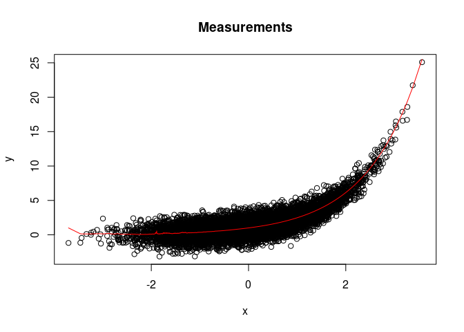

``` r
plot(beta_non_lin_est, type='l',
 main = "State-Space",
 xlab = "Iteration",
 ylab = "State"
)
abline(h = 0.9, col = 'red', lty = 2)
```

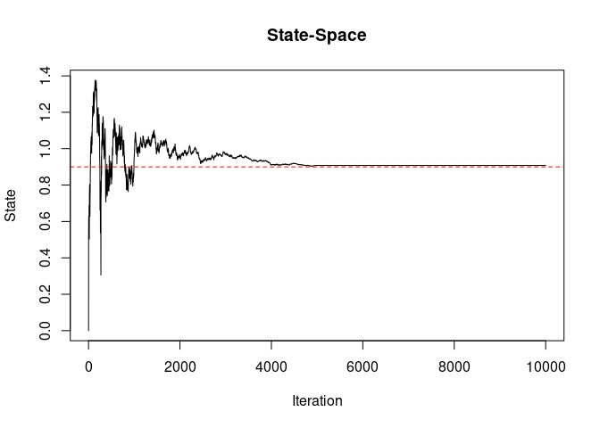

As we can see, increasing the number of observations leads to a better
estimation throughout the range of the x-values.

Concluding, the Kalman-Filter is a closed form solution for linear-, and
the Extended-Kalman-Filter an approximate solution for non-linear
dynamic stochastic systems, given that state and process noise are
gaussian. If the assumption of the gaussian distribution of either state
or process is dropped, the Kalman-Filter is not applicable anymore, and
a more general framework is required to handle non gaussian
distributions.

# Particle Filter

Given the state-space model and providing an explicit form of the model
such as:

  
 + \\varepsilon_{t-1} \\\\
    \\textbf{y}_t &= \\textbf{g}(\\textbf{x}_{t}) + \\nu_t \\\\
\\end{align*}
")  

we might not be able to find an exact solution to either problem. Thus
instead of trying to find an exact solution, we are interested in
finding:

  
![&#10;\\begin{equation\*}&#10; \\begin{aligned}&#10;
\\mathbb{E}\[\\textbf{y}\_t\] &=
\\mathbb{E}\[\\textbf{g}(\\textbf{x}\_{t})+ \\nu\_t\] \\\\&#10; &=
\\mathbb{E}\[\\textbf{g}(\\textbf{x}\_{t})\] \\\\&#10; &= \\int
\\textbf{g}(\\textbf{x}\_{t}) p(\\textbf{x}\_{t}|\\textbf{y}\_{1:t})
\\textbf{dx}\_t&#10;
\\end{aligned}&#10;\\end{equation\*}&#10;](https://latex.codecogs.com/png.image?%5Cdpi%7B110%7D&space;%5Cbg_white&space;%0A%5Cbegin%7Bequation%2A%7D%0A%20%20%20%20%5Cbegin%7Baligned%7D%0A%20%20%20%20%20%20%20%20%5Cmathbb%7BE%7D%5B%5Ctextbf%7By%7D_t%5D%20%26%3D%20%5Cmathbb%7BE%7D%5B%5Ctextbf%7Bg%7D%28%5Ctextbf%7Bx%7D_%7Bt%7D%29%2B%20%5Cnu_t%5D%20%5C%5C%0A%20%20%20%20%20%20%20%20%26%3D%20%5Cmathbb%7BE%7D%5B%5Ctextbf%7Bg%7D%28%5Ctextbf%7Bx%7D_%7Bt%7D%29%5D%20%5C%5C%0A%20%20%20%20%20%20%20%20%26%3D%20%5Cint%20%20%5Ctextbf%7Bg%7D%28%5Ctextbf%7Bx%7D_%7Bt%7D%29%20p%28%5Ctextbf%7Bx%7D_%7Bt%7D%7C%5Ctextbf%7By%7D_%7B1%3At%7D%29%20%5Ctextbf%7Bdx%7D_t%0A%20%20%20%20%5Cend%7Baligned%7D%0A%5Cend%7Bequation%2A%7D%0A
"
\\begin{equation*}
    \\begin{aligned}
        \\mathbb{E}[\\textbf{y}_t] &= \\mathbb{E}[\\textbf{g}(\\textbf{x}_{t})+ \\nu_t] \\\\
        &= \\mathbb{E}[\\textbf{g}(\\textbf{x}_{t})] \\\\
        &= \\int  \\textbf{g}(\\textbf{x}_{t}) p(\\textbf{x}_{t}|\\textbf{y}_{1:t}) \\textbf{dx}_t
    \\end{aligned}
\\end{equation*}
")  

assuming ![\\mathbb{E}\[\\nu\_t\]
= 0](https://latex.codecogs.com/png.image?%5Cdpi%7B110%7D&space;%5Cbg_white&space;%5Cmathbb%7BE%7D%5B%5Cnu_t%5D%20%3D%200
"\\mathbb{E}[\\nu_t] = 0"). If we can’t evaluate this integral
analytically or numerically, we can apply monte carlo integration due to
the fact that:

  
![&#10;\\begin{equation\*} &#10;
\\mathbb{E}\[\\textbf{g}(\\textbf{x}\_{t})\] \\approx \\frac{1}{N}
\\sum\_{i=1}^N
\\textbf{g}(\\textbf{x}\_{t}^{(i)})&#10;\\end{equation\*}&#10;](https://latex.codecogs.com/png.image?%5Cdpi%7B110%7D&space;%5Cbg_white&space;%0A%5Cbegin%7Bequation%2A%7D%20%0A%20%20%20%20%5Cmathbb%7BE%7D%5B%5Ctextbf%7Bg%7D%28%5Ctextbf%7Bx%7D_%7Bt%7D%29%5D%20%5Capprox%20%5Cfrac%7B1%7D%7BN%7D%20%5Csum_%7Bi%3D1%7D%5EN%20%5Ctextbf%7Bg%7D%28%5Ctextbf%7Bx%7D_%7Bt%7D%5E%7B%28i%29%7D%29%0A%5Cend%7Bequation%2A%7D%0A
"
\\begin{equation*} 
    \\mathbb{E}[\\textbf{g}(\\textbf{x}_{t})] \\approx \\frac{1}{N} \\sum_{i=1}^N \\textbf{g}(\\textbf{x}_{t}^{(i)})
\\end{equation*}
")  

where },\\ i = 1,...,N") are samples from
"). If we are unable to sample from
"), we can use importance sampling
to evaluate
![\\mathbb{E}\[\\textbf{g}(\\textbf{x}\_{t})\]](https://latex.codecogs.com/png.image?%5Cdpi%7B110%7D&space;%5Cbg_white&space;%5Cmathbb%7BE%7D%5B%5Ctextbf%7Bg%7D%28%5Ctextbf%7Bx%7D_%7Bt%7D%29%5D
"\\mathbb{E}[\\textbf{g}(\\textbf{x}_{t})]").

## Importance Sampling

The key idea behind importance sampling is to replace the sample of a
random variable } \\sim G(\\cdot)"), where
") is the target distribution, with sampling from an
importance distribution } \\sim \\pi(\\cdot)"). The algorithm consists of the
following steps:

  - Draw samples from: } \\sim \\pi(\\cdot)")
  - Calculate weights: } = \\frac{g(\\textbf{x}^{(i)})}{\\pi(\\textbf{x}^{(i)})}")
  - Normalize weights: } = \\frac{\\textbf{w}^{*(i)}}{\\sum \\textbf{w}^{*(i)}}")
  - Calculate quantity of interest.

Applying this algorithm to calculate
![\\mathbb{E}\[\\textbf{g(x)}|\\textbf{y}\_{1:t}\]](https://latex.codecogs.com/png.image?%5Cdpi%7B110%7D&space;%5Cbg_white&space;%5Cmathbb%7BE%7D%5B%5Ctextbf%7Bg%28x%29%7D%7C%5Ctextbf%7By%7D_%7B1%3At%7D%5D
"\\mathbb{E}[\\textbf{g(x)}|\\textbf{y}_{1:t}]"), we obtain the
following results for calculating the weights:   
![&#10;\\begin{equation}&#10; \\begin{aligned}&#10;
\\mathbb{E}\[\\textbf{g(x)}|\\textbf{y}\_{1:t}\] &= \\int
\\textbf{g}(\\textbf{x}) p(\\textbf{x}|\\textbf{y}\_{1:t}) \\textbf{dx}
\\\\&#10; &= \\int \\textbf{g}(\\textbf{x})
\\frac{p(\\textbf{y}\_{1:t}|\\textbf{x}) p(\\textbf{x}) }{\\int
p(\\textbf{y}\_{1:t}|\\textbf{x})p(\\textbf{x})} \\textbf{dx} \\\\&#10;
&= \\frac{ \\int\\textbf{g}(\\textbf{x})
(\\frac{p(\\textbf{y}\_{1:t}|\\textbf{x}) p(\\textbf{x})
}{\\pi(\\textbf{x})}) \\pi(\\textbf{x}) }&#10; {\\int
\\frac{p(\\textbf{y}\_{1:t}|\\textbf{x}) p(\\textbf{x})
}{\\pi(\\textbf{x})} \\pi(\\textbf{x}) \\textbf{dx}} \\textbf{dx}
\\\\&#10; &\\approx \\frac{ \\frac{1}{N} \\sum\_{i=1}^N
\\textbf{g}(\\textbf{x}^{(i)})
(\\frac{p(\\textbf{y}\_{1:t}|\\textbf{x}^{(i)}) p(\\textbf{x}^{(i)})
}{\\pi(\\textbf{x}^{(i)}|\\textbf{y}\_{1:t})}) }&#10; {\\frac{1}{N}
\\sum\_{j=1}^N \\frac{p(\\textbf{y}\_{1:t}|\\textbf{x}^{(j)})
p(\\textbf{x}^{(j)}) }{\\pi(\\textbf{x}^{(j)}|\\textbf{y}\_{1:t})} }
\\\\&#10; &= \\sum\_{i=1}^N \\bigg(\\frac{
\\frac{p(\\textbf{y}\_{1:t}|\\textbf{x}^{(i)}) p(\\textbf{x}^{(i)})
}{\\pi(\\textbf{x}^{(i)}|\\textbf{y}\_{1:t})} }&#10; {\\sum\_{j=1}^N
\\frac{p(\\textbf{y}\_{1:t}|\\textbf{x}\_t^{(j)})
p(\\textbf{x}\_t^{(j)}) }{\\pi(\\textbf{x}^{(j)}|\\textbf{y}\_{1:t})} }
\\bigg)\\textbf{g}(\\textbf{x}^{(i)}) \\\\&#10;
\\end{aligned}&#10;\\end{equation}&#10;](https://latex.codecogs.com/png.image?%5Cdpi%7B110%7D&space;%5Cbg_white&space;%0A%5Cbegin%7Bequation%7D%0A%20%20%20%20%5Cbegin%7Baligned%7D%0A%20%20%20%20%20%20%20%20%5Cmathbb%7BE%7D%5B%5Ctextbf%7Bg%28x%29%7D%7C%5Ctextbf%7By%7D_%7B1%3At%7D%5D%20%26%3D%20%5Cint%20%20%5Ctextbf%7Bg%7D%28%5Ctextbf%7Bx%7D%29%20p%28%5Ctextbf%7Bx%7D%7C%5Ctextbf%7By%7D_%7B1%3At%7D%29%20%5Ctextbf%7Bdx%7D%20%5C%5C%0A%20%20%20%20%20%20%20%20%20%20%20%20%20%20%20%20%20%20%20%20%20%20%20%20%20%20%20%20%20%20%20%20%20%26%3D%20%5Cint%20%20%5Ctextbf%7Bg%7D%28%5Ctextbf%7Bx%7D%29%20%5Cfrac%7Bp%28%5Ctextbf%7By%7D_%7B1%3At%7D%7C%5Ctextbf%7Bx%7D%29%20p%28%5Ctextbf%7Bx%7D%29%20%7D%7B%5Cint%20p%28%5Ctextbf%7By%7D_%7B1%3At%7D%7C%5Ctextbf%7Bx%7D%29p%28%5Ctextbf%7Bx%7D%29%7D%20%5Ctextbf%7Bdx%7D%20%5C%5C%0A%20%20%20%20%20%20%20%20%20%20%20%20%20%20%20%20%20%20%20%20%20%20%20%20%20%20%20%20%20%20%20%20%20%26%3D%20%20%20%20%5Cfrac%7B%20%5Cint%5Ctextbf%7Bg%7D%28%5Ctextbf%7Bx%7D%29%20%28%5Cfrac%7Bp%28%5Ctextbf%7By%7D_%7B1%3At%7D%7C%5Ctextbf%7Bx%7D%29%20p%28%5Ctextbf%7Bx%7D%29%20%7D%7B%5Cpi%28%5Ctextbf%7Bx%7D%29%7D%29%20%5Cpi%28%5Ctextbf%7Bx%7D%29%20%7D%0A%20%20%20%20%20%20%20%20%20%20%20%20%20%20%20%20%20%20%20%20%20%20%20%20%20%20%20%20%20%20%20%20%20%7B%5Cint%20%5Cfrac%7Bp%28%5Ctextbf%7By%7D_%7B1%3At%7D%7C%5Ctextbf%7Bx%7D%29%20p%28%5Ctextbf%7Bx%7D%29%20%7D%7B%5Cpi%28%5Ctextbf%7Bx%7D%29%7D%20%5Cpi%28%5Ctextbf%7Bx%7D%29%20%5Ctextbf%7Bdx%7D%7D%20%5Ctextbf%7Bdx%7D%20%5C%5C%0A%20%20%20%20%20%20%20%20%20%20%20%20%20%20%20%20%20%20%20%20%20%20%20%20%20%20%20%20%20%20%20%20%20%26%5Capprox%20%5Cfrac%7B%20%5Cfrac%7B1%7D%7BN%7D%20%5Csum_%7Bi%3D1%7D%5EN%20%5Ctextbf%7Bg%7D%28%5Ctextbf%7Bx%7D%5E%7B%28i%29%7D%29%20%28%5Cfrac%7Bp%28%5Ctextbf%7By%7D_%7B1%3At%7D%7C%5Ctextbf%7Bx%7D%5E%7B%28i%29%7D%29%20p%28%5Ctextbf%7Bx%7D%5E%7B%28i%29%7D%29%20%7D%7B%5Cpi%28%5Ctextbf%7Bx%7D%5E%7B%28i%29%7D%7C%5Ctextbf%7By%7D_%7B1%3At%7D%29%7D%29%20%20%7D%0A%20%20%20%20%20%20%20%20%20%20%20%20%20%20%20%20%20%20%20%20%20%20%20%20%20%20%20%20%20%20%20%20%20%7B%5Cfrac%7B1%7D%7BN%7D%20%5Csum_%7Bj%3D1%7D%5EN%20%5Cfrac%7Bp%28%5Ctextbf%7By%7D_%7B1%3At%7D%7C%5Ctextbf%7Bx%7D%5E%7B%28j%29%7D%29%20p%28%5Ctextbf%7Bx%7D%5E%7B%28j%29%7D%29%20%7D%7B%5Cpi%28%5Ctextbf%7Bx%7D%5E%7B%28j%29%7D%7C%5Ctextbf%7By%7D_%7B1%3At%7D%29%7D%20%7D%20%5C%5C%0A%20%20%20%20%20%20%20%20%20%20%20%20%20%20%20%20%20%20%20%20%20%20%20%20%20%20%20%20%20%20%20%20%20%26%3D%20%5Csum_%7Bi%3D1%7D%5EN%20%5Cbigg%28%5Cfrac%7B%20%20%5Cfrac%7Bp%28%5Ctextbf%7By%7D_%7B1%3At%7D%7C%5Ctextbf%7Bx%7D%5E%7B%28i%29%7D%29%20p%28%5Ctextbf%7Bx%7D%5E%7B%28i%29%7D%29%20%7D%7B%5Cpi%28%5Ctextbf%7Bx%7D%5E%7B%28i%29%7D%7C%5Ctextbf%7By%7D_%7B1%3At%7D%29%7D%20%20%7D%0A%20%20%20%20%20%20%20%20%20%20%20%20%20%20%20%20%20%20%20%20%20%20%20%20%20%20%20%20%20%20%20%20%20%7B%5Csum_%7Bj%3D1%7D%5EN%20%5Cfrac%7Bp%28%5Ctextbf%7By%7D_%7B1%3At%7D%7C%5Ctextbf%7Bx%7D_t%5E%7B%28j%29%7D%29%20p%28%5Ctextbf%7Bx%7D_t%5E%7B%28j%29%7D%29%20%7D%7B%5Cpi%28%5Ctextbf%7Bx%7D%5E%7B%28j%29%7D%7C%5Ctextbf%7By%7D_%7B1%3At%7D%29%7D%20%7D%20%5Cbigg%29%5Ctextbf%7Bg%7D%28%5Ctextbf%7Bx%7D%5E%7B%28i%29%7D%29%20%5C%5C%0A%20%20%20%20%5Cend%7Baligned%7D%0A%5Cend%7Bequation%7D%0A
"
\\begin{equation}
    \\begin{aligned}
        \\mathbb{E}[\\textbf{g(x)}|\\textbf{y}_{1:t}] &= \\int  \\textbf{g}(\\textbf{x}) p(\\textbf{x}|\\textbf{y}_{1:t}) \\textbf{dx} \\\\
                                 &= \\int  \\textbf{g}(\\textbf{x}) \\frac{p(\\textbf{y}_{1:t}|\\textbf{x}) p(\\textbf{x}) }{\\int p(\\textbf{y}_{1:t}|\\textbf{x})p(\\textbf{x})} \\textbf{dx} \\\\
                                 &=    \\frac{ \\int\\textbf{g}(\\textbf{x}) (\\frac{p(\\textbf{y}_{1:t}|\\textbf{x}) p(\\textbf{x}) }{\\pi(\\textbf{x})}) \\pi(\\textbf{x}) }
                                 {\\int \\frac{p(\\textbf{y}_{1:t}|\\textbf{x}) p(\\textbf{x}) }{\\pi(\\textbf{x})} \\pi(\\textbf{x}) \\textbf{dx}} \\textbf{dx} \\\\
                                 &\\approx \\frac{ \\frac{1}{N} \\sum_{i=1}^N \\textbf{g}(\\textbf{x}^{(i)}) (\\frac{p(\\textbf{y}_{1:t}|\\textbf{x}^{(i)}) p(\\textbf{x}^{(i)}) }{\\pi(\\textbf{x}^{(i)}|\\textbf{y}_{1:t})})  }
                                 {\\frac{1}{N} \\sum_{j=1}^N \\frac{p(\\textbf{y}_{1:t}|\\textbf{x}^{(j)}) p(\\textbf{x}^{(j)}) }{\\pi(\\textbf{x}^{(j)}|\\textbf{y}_{1:t})} } \\\\
                                 &= \\sum_{i=1}^N \\bigg(\\frac{  \\frac{p(\\textbf{y}_{1:t}|\\textbf{x}^{(i)}) p(\\textbf{x}^{(i)}) }{\\pi(\\textbf{x}^{(i)}|\\textbf{y}_{1:t})}  }
                                 {\\sum_{j=1}^N \\frac{p(\\textbf{y}_{1:t}|\\textbf{x}_t^{(j)}) p(\\textbf{x}_t^{(j)}) }{\\pi(\\textbf{x}^{(j)}|\\textbf{y}_{1:t})} } \\bigg)\\textbf{g}(\\textbf{x}^{(i)}) \\\\
    \\end{aligned}
\\end{equation}
")  

  
} := \\frac{  \\frac{p(\\textbf{y}_{1:t}|\\textbf{x}^{(i)}) p(\\textbf{x}^{(i)}) }{\\pi(\\textbf{x}_{t}^{(i)})}  }
    {\\sum_{j=1}^N \\frac{p(\\textbf{y}_{1:t}|\\textbf{x}^{(j)}) p(\\textbf{x}^{(j)}) }{\\pi(\\textbf{x}^{(j)})} }
\\end{equation*}
")  

Then:   
![&#10;\\begin{equation\*}&#10;
\\mathbb{E}\[\\textbf{g(x)}|\\textbf{y}\_{1:t}\] = \\sum\_{i=1}^N
w^{(i)}\\textbf{g}(\\textbf{x}^{(i)})&#10;\\end{equation\*}&#10;](https://latex.codecogs.com/png.image?%5Cdpi%7B110%7D&space;%5Cbg_white&space;%0A%5Cbegin%7Bequation%2A%7D%0A%20%20%20%20%5Cmathbb%7BE%7D%5B%5Ctextbf%7Bg%28x%29%7D%7C%5Ctextbf%7By%7D_%7B1%3At%7D%5D%20%3D%20%5Csum_%7Bi%3D1%7D%5EN%20w%5E%7B%28i%29%7D%5Ctextbf%7Bg%7D%28%5Ctextbf%7Bx%7D%5E%7B%28i%29%7D%29%0A%5Cend%7Bequation%2A%7D%0A
"
\\begin{equation*}
    \\mathbb{E}[\\textbf{g(x)}|\\textbf{y}_{1:t}] = \\sum_{i=1}^N w^{(i)}\\textbf{g}(\\textbf{x}^{(i)})
\\end{equation*}
")  

and the posterior density can be approximated according to:   
 \\approx \\sum_{i=1}^N w^{(i)}\\delta(\\textbf{x} - \\textbf{x}^{(i)})
\\end{equation*}
")  

## Example

Due to its critical role in the Particle-Filter, this section presents
an example for the importance sampling algorithm. Let ") and assume further we are interested in
calculating
![\\mathbb{E}\[cos(X)^2\]](https://latex.codecogs.com/png.image?%5Cdpi%7B110%7D&space;%5Cbg_white&space;%5Cmathbb%7BE%7D%5Bcos%28X%29%5E2%5D
"\\mathbb{E}[cos(X)^2]"). The first step in the importance sampling
algorithm consists of choosing the importance density
"). To choose the importance density, we are interested in a
density which is as “close” as possible to the quantity of interest,
since theoretically all distributions for which  are applicable as
importance distributions.

The following figure presents different densities in the interval ![x
\\in
\[-3,3\]](https://latex.codecogs.com/png.image?%5Cdpi%7B110%7D&space;%5Cbg_white&space;x%20%5Cin%20%5B-3%2C3%5D
"x \\in [-3,3]"). The black line depicts the function
^2*dnorm(x)"), the green line is the density of a standard
normal-, the red line the density of a Laplace ") - and the blue line the density of a uniform
") distributed random variable. The figure shows that the target
density, the standard normal in this case, is not obviously the best
density to choose from. The Laplace density is in certain areas closer
to
^2*dnorm(x)") than the standard normal density. Using numeric
integration we obtain: ^2*dnorm(x)dx \\approx 0.5651"). Next we draw
 samples from each distribution and calculate:

  
})^2*dnorm(x^{(i)})}{\\pi(x^{(i)})} 
\\end{equation*}
")  

for which we obtained
 for the Laplace-,
 for the standard normal- and
 for the uniform distribution. Hence they are all close to the
numeric solution, but the Laplace distribution is the closest. Thus we
would choose the Laplace distribution as the importance distribution.

``` r
##################################################################################################################
#############################     PARTICLE FILTER SIMULATION     #################################################
##################################################################################################################

# importance sampling example

set.seed(0)
# generate x-values in the range of -3,3
x <- seq(-3,3,by=0.1)

# plot importance densities and target function
plot(x, f(x)*dnorm(x), type='l', xlim=c(-5,5), ylim=c(0,0.5), 
    main="Comparing Distributions",
    ylab = "cos(x^2) * dnorm"
)
lines(x, dlaplace(x),col='red')
lines(x, dnorm(x),col='green')
lines(x, dunif(x, -3,3),col='blue')
```

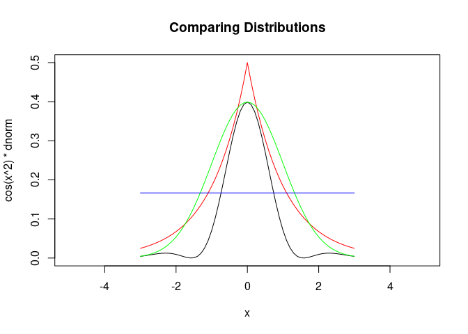

``` r
# perform monte carlo integration to calculate the expected values
n <- length(x)
set.seed(0)
norm_samples  <- rnorm(n)
lapl_samples <- rlaplace(1, runif(n))
unif_samples_2 <- runif(n, -3, 3)
mean( f(lapl_samples) * dnorm(lapl_samples) / dlaplace(lapl_samples, 1, 0))
```

    ## [1] 0.6355556

``` r
mean( f(unif_samples_2) * dnorm(unif_samples_2) / dunif(unif_samples_2, -3, 3))
```

    ## [1] 0.5900178

``` r
mean( f(norm_samples) * dnorm(norm_samples) / dnorm(norm_samples))
```

    ## [1] 0.5835453

## Sequential Importance Sampling

To solve the estimation problem:   
![&#10;\\begin{equation\*}&#10; \\begin{aligned}&#10;
p(\\textbf{x}\_{0:t}|\\textbf{y}\_{1:t}) &\\propto
p(\\textbf{y}\_{t}|\\textbf{x}\_{0:t},\\textbf{y}\_{1:t-1}) \\\\&#10; &=
p(\\textbf{y}\_{t}|\\textbf{x}\_{t})p(\\textbf{x}\_{t}|\\textbf{x}\_{0:t-1},
\\textbf{y}\_{1:t-1}) \\\\&#10; &=
p(\\textbf{y}\_{t}|\\textbf{x}\_{t})p(\\textbf{x}\_{t}|\\textbf{x}\_{t-1})
p(\\textbf{x}\_{0:t-1}|\\textbf{y}\_{1:t-1}) \\\\&#10;
\\end{aligned}&#10;\\end{equation\*}&#10;](https://latex.codecogs.com/png.image?%5Cdpi%7B110%7D&space;%5Cbg_white&space;%0A%5Cbegin%7Bequation%2A%7D%0A%20%20%20%20%5Cbegin%7Baligned%7D%0A%20%20%20%20%20%20%20%20p%28%5Ctextbf%7Bx%7D_%7B0%3At%7D%7C%5Ctextbf%7By%7D_%7B1%3At%7D%29%20%26%5Cpropto%20p%28%5Ctextbf%7By%7D_%7Bt%7D%7C%5Ctextbf%7Bx%7D_%7B0%3At%7D%2C%5Ctextbf%7By%7D_%7B1%3At-1%7D%29%20%5C%5C%0A%20%20%20%20%20%20%20%20%20%20%20%20%20%20%20%20%20%20%20%20%20%20%20%20%20%20%20%20%20%20%20%20%20%20%20%20%20%20%20%20%20%20%20%20%20%26%3D%20p%28%5Ctextbf%7By%7D_%7Bt%7D%7C%5Ctextbf%7Bx%7D_%7Bt%7D%29p%28%5Ctextbf%7Bx%7D_%7Bt%7D%7C%5Ctextbf%7Bx%7D_%7B0%3At-1%7D%2C%20%5Ctextbf%7By%7D_%7B1%3At-1%7D%29%20%5C%5C%0A%20%20%20%20%20%20%20%20%20%20%20%20%20%20%20%20%20%20%20%20%20%20%20%20%20%20%20%20%20%20%20%20%20%20%20%20%20%20%20%20%20%20%20%20%20%26%3D%20p%28%5Ctextbf%7By%7D_%7Bt%7D%7C%5Ctextbf%7Bx%7D_%7Bt%7D%29p%28%5Ctextbf%7Bx%7D_%7Bt%7D%7C%5Ctextbf%7Bx%7D_%7Bt-1%7D%29%20p%28%5Ctextbf%7Bx%7D_%7B0%3At-1%7D%7C%5Ctextbf%7By%7D_%7B1%3At-1%7D%29%20%5C%5C%0A%20%20%20%20%5Cend%7Baligned%7D%0A%5Cend%7Bequation%2A%7D%0A
"
\\begin{equation*}
    \\begin{aligned}
        p(\\textbf{x}_{0:t}|\\textbf{y}_{1:t}) &\\propto p(\\textbf{y}_{t}|\\textbf{x}_{0:t},\\textbf{y}_{1:t-1}) \\\\
                                             &= p(\\textbf{y}_{t}|\\textbf{x}_{t})p(\\textbf{x}_{t}|\\textbf{x}_{0:t-1}, \\textbf{y}_{1:t-1}) \\\\
                                             &= p(\\textbf{y}_{t}|\\textbf{x}_{t})p(\\textbf{x}_{t}|\\textbf{x}_{t-1}) p(\\textbf{x}_{0:t-1}|\\textbf{y}_{1:t-1}) \\\\
    \\end{aligned}
\\end{equation*}
")  

where the quantity
") was decomposed into 2 objects
for which there is a model
p(\\textbf{x}_{t}|\\textbf{x}_{t-1})")
and one which is assumed to be known
"). Since these quantities
might be too difficult to calculate analytically, we can apply the
importance sample algorithm sequentially and draw samples
} \\sim \\pi(\\textbf{x}_{0:t}|\\textbf{y}_{1:t})")
  
 = \\pi(\\textbf{x}_{t}|\\textbf{x}_{0:t-1},\\textbf{y}_{1:t})\\pi(\\textbf{x}_{0:t-1}|\\textbf{y}_{1:t})
\\end{equation*}
")  
and we obtain:   
![&#10;\\begin{equation\*}&#10; \\begin{aligned}&#10; w\_t^{(i)}
&\\propto
\\frac{p(\\textbf{y}\_{t}|\\textbf{x}\_{t}^{(i)})p(\\textbf{x}\_{t}^{(i)}|\\textbf{x}\_{t-1}^{(i)})
}{\\pi(\\textbf{x}\_{t}^{(i)}|\\textbf{x}\_{0:t-1}^{(i)},\\textbf{y}\_{1:t})}
\\frac{p(\\textbf{x}\_{0:t-1}^{(i)}|\\textbf{y}\_{1:t-1})}{\\pi(\\textbf{x}\_{0:t-1}^{(i)}|\\textbf{y}\_{1:t})}
\\\\&#10; w\_{t-1}^{(i)} &\\propto
\\frac{p(\\textbf{x}\_{0:t-1}^{(i)}|\\textbf{y}\_{1:t-1})}{\\pi(\\textbf{x}\_{0:t-1}^{(i)}|\\textbf{y}\_{1:t})}
\\\\&#10; w\_t^{(i)} &\\propto w\_{t-1}^{(i)}
\\frac{p(\\textbf{y}\_{t}|\\textbf{x}\_{t}^{(i)})p(\\textbf{x}\_{t}^{(i)}|\\textbf{x}\_{t-1}^{(i)})
}{\\pi(\\textbf{x}\_{t}^{(i)}|\\textbf{x}\_{0:t-1}^{(i)},\\textbf{y}\_{1:t})}&#10;
\\end{aligned}&#10;\\end{equation\*}&#10;](https://latex.codecogs.com/png.image?%5Cdpi%7B110%7D&space;%5Cbg_white&space;%0A%5Cbegin%7Bequation%2A%7D%0A%20%20%20%20%5Cbegin%7Baligned%7D%0A%20%20%20%20%20%20%20%20w_t%5E%7B%28i%29%7D%20%26%5Cpropto%20%5Cfrac%7Bp%28%5Ctextbf%7By%7D_%7Bt%7D%7C%5Ctextbf%7Bx%7D_%7Bt%7D%5E%7B%28i%29%7D%29p%28%5Ctextbf%7Bx%7D_%7Bt%7D%5E%7B%28i%29%7D%7C%5Ctextbf%7Bx%7D_%7Bt-1%7D%5E%7B%28i%29%7D%29%20%7D%7B%5Cpi%28%5Ctextbf%7Bx%7D_%7Bt%7D%5E%7B%28i%29%7D%7C%5Ctextbf%7Bx%7D_%7B0%3At-1%7D%5E%7B%28i%29%7D%2C%5Ctextbf%7By%7D_%7B1%3At%7D%29%7D%20%5Cfrac%7Bp%28%5Ctextbf%7Bx%7D_%7B0%3At-1%7D%5E%7B%28i%29%7D%7C%5Ctextbf%7By%7D_%7B1%3At-1%7D%29%7D%7B%5Cpi%28%5Ctextbf%7Bx%7D_%7B0%3At-1%7D%5E%7B%28i%29%7D%7C%5Ctextbf%7By%7D_%7B1%3At%7D%29%7D%20%5C%5C%0A%20%20%20%20%20%20%20%20w_%7Bt-1%7D%5E%7B%28i%29%7D%20%26%5Cpropto%20%5Cfrac%7Bp%28%5Ctextbf%7Bx%7D_%7B0%3At-1%7D%5E%7B%28i%29%7D%7C%5Ctextbf%7By%7D_%7B1%3At-1%7D%29%7D%7B%5Cpi%28%5Ctextbf%7Bx%7D_%7B0%3At-1%7D%5E%7B%28i%29%7D%7C%5Ctextbf%7By%7D_%7B1%3At%7D%29%7D%20%5C%5C%0A%20%20%20%20%20%20%20%20w_t%5E%7B%28i%29%7D%20%26%5Cpropto%20%20w_%7Bt-1%7D%5E%7B%28i%29%7D%20%5Cfrac%7Bp%28%5Ctextbf%7By%7D_%7Bt%7D%7C%5Ctextbf%7Bx%7D_%7Bt%7D%5E%7B%28i%29%7D%29p%28%5Ctextbf%7Bx%7D_%7Bt%7D%5E%7B%28i%29%7D%7C%5Ctextbf%7Bx%7D_%7Bt-1%7D%5E%7B%28i%29%7D%29%20%7D%7B%5Cpi%28%5Ctextbf%7Bx%7D_%7Bt%7D%5E%7B%28i%29%7D%7C%5Ctextbf%7Bx%7D_%7B0%3At-1%7D%5E%7B%28i%29%7D%2C%5Ctextbf%7By%7D_%7B1%3At%7D%29%7D%0A%20%20%20%20%5Cend%7Baligned%7D%0A%5Cend%7Bequation%2A%7D%0A
"
\\begin{equation*}
    \\begin{aligned}
        w_t^{(i)} &\\propto \\frac{p(\\textbf{y}_{t}|\\textbf{x}_{t}^{(i)})p(\\textbf{x}_{t}^{(i)}|\\textbf{x}_{t-1}^{(i)}) }{\\pi(\\textbf{x}_{t}^{(i)}|\\textbf{x}_{0:t-1}^{(i)},\\textbf{y}_{1:t})} \\frac{p(\\textbf{x}_{0:t-1}^{(i)}|\\textbf{y}_{1:t-1})}{\\pi(\\textbf{x}_{0:t-1}^{(i)}|\\textbf{y}_{1:t})} \\\\
        w_{t-1}^{(i)} &\\propto \\frac{p(\\textbf{x}_{0:t-1}^{(i)}|\\textbf{y}_{1:t-1})}{\\pi(\\textbf{x}_{0:t-1}^{(i)}|\\textbf{y}_{1:t})} \\\\
        w_t^{(i)} &\\propto  w_{t-1}^{(i)} \\frac{p(\\textbf{y}_{t}|\\textbf{x}_{t}^{(i)})p(\\textbf{x}_{t}^{(i)}|\\textbf{x}_{t-1}^{(i)}) }{\\pi(\\textbf{x}_{t}^{(i)}|\\textbf{x}_{0:t-1}^{(i)},\\textbf{y}_{1:t})}
    \\end{aligned}
\\end{equation*}
")  

Note that if we choose $(\_{t}<sup>{(i)}|*{0:t-1}<sup>{(i)},*{1:t}) =
p(*{t}</sup>{(i)}|*{t-1}</sup>{(i)}) $ then the problem simplifies to:

  
} \\propto  w_{t-1}^{(i)} p(\\textbf{y}_{t}|\\textbf{x}_{t}^{(i)})
\\end{equation*}
")  

## Sequential Importance Resampling

Applying the sequential importance sampling leads to a phenomenon called
the degeneracy problem. The degeneracy problem refers to the phenomenon
that when applying the importance sampling algorithm sequentially, it
leads to all but one weight to be close to
. To overcome this problem, adding a resampling procedure, where the
samples form the posterior
") are drawn form the previous
samples
}") with the probabilities given by
}"). These samples are also referred to as particles  and thus
the name Particle-Filter for the sequential importance resample
algorithm. In the following we present two examples of the
Particle-Filter at work.

## Particle-Filter Example

For the first example we generate data according to:

  
 + 8*cos(1.2*(t-1)) + \\varepsilon_{t-1},\\ \\varepsilon_{t-1} \\sim \\mathcal{N}(0,1)\\\\
        y_t  &= x_t^2/20 + \\nu_t, \\ \\nu_t \\sim \\mathcal{N}(0,1)
    \\end{aligned}
\\end{equation*}
")  

``` r
# particle filter simulatin example 1

# init state
x <- 0.1
# process noise
x_N <- 1 
# measurement noise
x_R <- 1
# duration
T <- 100
# num particles
N <- 1000
# init var
V <- 2

# save variables
z_out <- numeric(T)
x_out <- numeric(T)
x_est <- numeric(T)
x_est_out <- numeric(T)
weight <- numeric(N)


set.seed(0)
# init particles
particles <- rnorm(N, x, sqrt(V))

for(t in 1:T){
    x  <- rnorm(1, state_update(x,t-1), x_N)
    z <- rnorm(1, measurement_update(x), 2)

    for(i in 1:N){
        particles[i] <- rnorm(1, state_update(particles[i],t-1), x_N)
        z_update <- measurement_update(particles[i])
        weight[i] <- dnorm(z, z_update, 2)
    }
    weight  <- weight / sum(weight)
    particles <- sample(particles, size=N, replace=TRUE, prob=weight)
    x_est <- mean(particles)
    x_out[t] <- x
    z_out[t] <- z
    x_est_out[t] <- x_est
}

plot(x_out, type='l', main="State Developement", xlab= "Iteration", ylab = "State")
lines(x_est_out, col='red', lty=2)
```

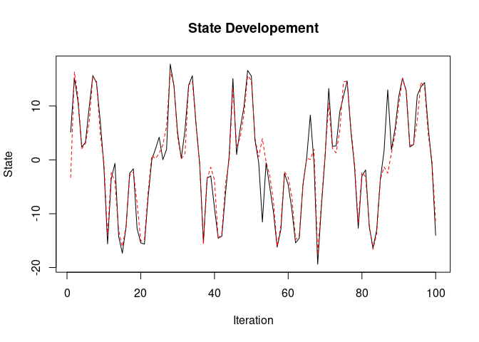

``` r
plot(z_out, type='l', main="Position Developement", xlab= "Iteration", ylab = "Position")
lines(measurement_update(x_est_out), col='red', lty=2)
```

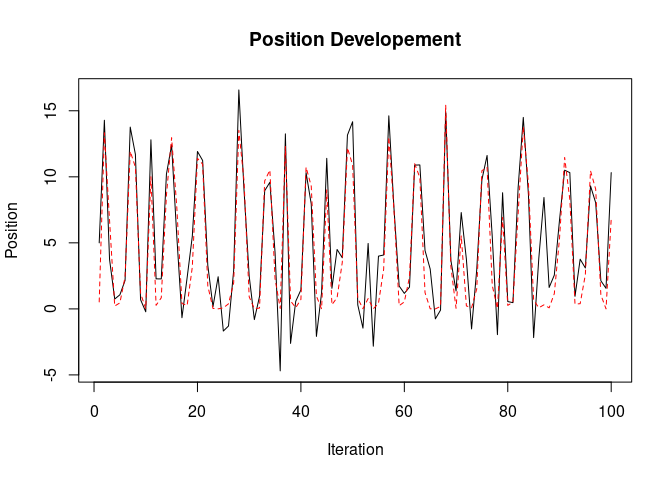

For the second example we try to estimate the movement of the volatility
index:

  
\\\\
        y_t  &= exp(x_t) + \\nu_t, \\ \\nu_t \\sim \\mathcal{N}(0,0.78)
    \\end{aligned}
\\end{equation*}
")  

The data is obtained from the Federal Reserve Bank of St. Louis.

``` r
# exaple stochastic volatility model

# read data
vix_orig <- read.csv("./VIXCLS.csv")

# inspect data
# dim(vix_orig)
# head(vix_orig)
# tail(vix_orig)

# missing values?
vix <- as.numeric(as.character(vix_orig[,2]))
```

    ## Warning: NAs introduced by coercion

``` r
# remove missing values
vix <- vix[!is.na(vix)]

# init variables
n <- 1000
T  <- length(vix)

# model parameters
a <- 0.69
b <- 1
sig_v <- 1.12
B <- 0.89
sig_w <- 0.78

# save estimate
x_est_out <- numeric(T)
# state <-numeric(T)

set.seed(0)

# generate particles
particles <- rnorm(n, sd = sig_v)

# perform calculations
for(t in 1:T){
    particles <- rnorm(n, mean=stochastic_volatility_state(particles, a, b), sd = sqrt(sig_v))
    z_update <- stochastic_volatility_process(particles)
    weight <- dnorm(vix[t], z_update, sig_w)
    # weight <- weight * dnorm(z[t], z_update, sig_w)
    weight  <- weight / sum(weight)
    particles <- sample(particles, size=n, replace=TRUE, prob=weight)
    x_est <- mean(particles)
    x_est_out[t] <- x_est
}

# save results

plot(vix, type='l', main="Vix", xlab= "Time", ylab = "Value")
lines(stochastic_volatility_process(x_est_out), col='red', lty=2)
```

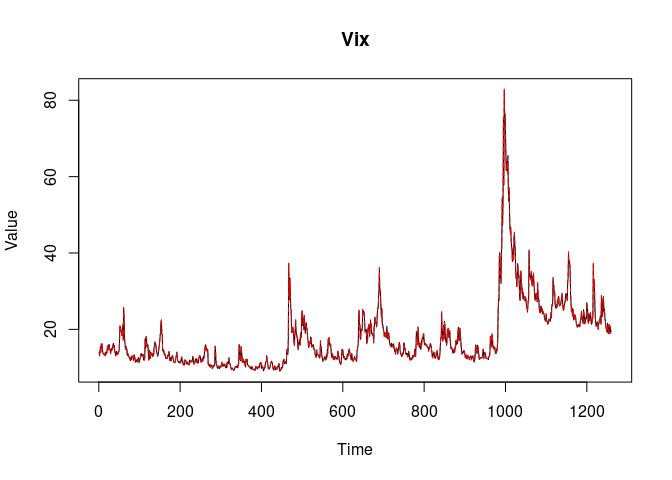

``` r
plot(vix[1:50], type='l', main="Vix First 50 Observations", xlab= "Time", ylab = "Value")
lines(stochastic_volatility_process(x_est_out)[1:50], col='red', lty=2)
```

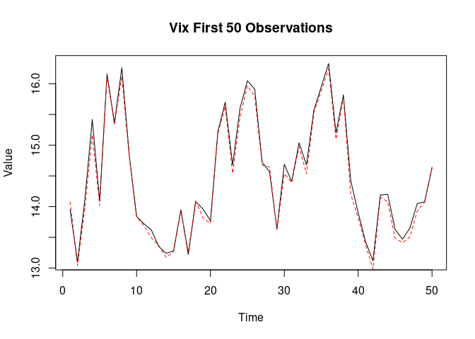

These two figures depicts the results of the Vix estimation for the
entire series. It looks like the original and the measurement are
identical. The upper figure presents the original data and estimation
for the first 50 observations. As we can see, they are not identical,
but the model captures the movement of the observations very well.

# Conclusio

In this work we presented an overview of Bayesian filtering techniques
by describing the Kalman- and Extended-Kalman-Filter as well as the
Particle-Filter with simulation studies for each model. For gaussian
models we have seen that there exists a closed- or approximately closed
form solution (Kalman-, Extended-Kalman-Filter respectively). Dropping
the assumption of the gaussian distribution lead to a more flexible
framework that can handle different distributional forms by relying on
Monte Carlo techniques.
