Mietspiegel
================
Vincent Grunert

  - [Executive Summary](#executive-summary)
  - [Daten](#daten)
      - [Datenkontrolle](#datenkontrolle)
      - [Datenaenderungen](#datenaenderungen)
      - [Univariate Analysen](#univariate-analysen)
      - [Bivariate Analysen](#bivariate-analysen)
      - [Trivariate Analysen](#trivariate-analysen)
  - [Modellselektion](#modellselektion)
      - [Entscheidungsbaum](#entscheidungsbaum)
      - [Variablenselektion und
        Modifikation](#variablenselektion-und-modifikation)
      - [Methode](#methode)
      - [Modell Selektion](#modell-selektion)
      - [Interpretation](#interpretation)
  - [Modell Analyse](#modell-analyse)
      - [Homogene Varianzen](#homogene-varianzen)
      - [Ausreisser](#ausreisser)
  - [Conclusio](#conclusio)

# Executive Summary

Ziel dieser Arbeit ist es ein Modell fuer die Schaetzung des
Nettomietpreises zu erhalten. Hierzu wurde eine ausfuehrliche
Datenkontrolle und -analyse durchgefuehrt. Anhand der Best Subset
Methode wurde das beste auf den Daten basierende lineare Modell
berechnet. Hinzufuegen von Interaktionstermen konnte zu keiner
Modellverbesserung fuehren.

Das Modell weist folgende Probleme auf: Zum einen gibt es inhomogene
Varianzen. Fuer dieses Modell fuehrte der Versuch, dieses Problem zu
beheben, jedoch zu einem schlechteren Ergebnis. Zum anderen konnten
einige Ausreisser in den Daten identifiziert werden. Aufgrund mangelnder
inhaltlicher Grundlage diese zu entfernen, werden diese im Modell
behalten.

Aus diesen Guenden wird zur Schaetzung des Nettomietpreises ein lineares
Modell mit allen bereitgestellten Variablen empfohlen.

# Daten

Im Folgenden werden die Ergebnisse der Datenkontrolle, Datenaenderungen,
Uni-, Bi- und Trivariate Analysen dargestellt.

## Datenkontrolle

Der Datensatz enthaelt insgesamt 1000 Beobachtungen von insgesamt 11
verschiedenen Variablen. Im ersten Schritt wurde eine formale
Datenkontrolle durchgefuehrt. Es konnten keine Fehler in den Daten
festgestellt werden. Konkret wurde auf fehlende- und unmoegliche Werte,
korrekte Datenformate und ob alle Werte den theoretisch Moeglichen
entsprechen. Hierbei handelt es sich nicht um eine Inhaltliche
Kontrolle, diese erfolgt im naechsten Abschnitt.

## Datenaenderungen

### Baujahr

Der Datensatz enthaelt die Variable “Baujahr”, fuer die folgende
Aenderungen durchgefuehrt wurden 1) Fuer eine verbesserte
Interpretierbarkeit wurde diese in “Alter” umcodiert. Das Alter
entspricht der Differenz aus den Jahr 2003 und dem Baujahr der Wohnung.
2) Das Alter wird in 20 Jahres Bloecke zusammengefasst. Den letzten
Block, “(80, 80+\]” umfasst alle Wohnungen die 80- oder mehr Jahre alt
sind.

Bei der Variable gibt es zwei Auffaelligkeiten. Zum einen sind 199
Wohnungen im Jahr 1918 gebaut worden und keine danach. Dies laesst eine
Zuordnung aller Wohnungen im Jahr 1918 oder frueher gebauten Wohnungen
zu diesem Baujahr vermuten. Zum anderen wurden zwei Wohnungen nicht wie
alle anderen einem ganzen Jahr zugeordnet sondern wurden im respektive
Jahreshaelfte nummeriert (zB 14.5 Jahre). Beide Punkte koennen durch die
Zusammenfassung in 20 Jahresbloecke gehandhabt werden. Weiters kann man
davon ausgehen, dass Jahr zu Jahr unterschiede sich nicht massgeblich
auf den Wohnungspreis auswirken sollte. In Summe wird somit eine
Zusammenfassung in 20 Jahres Bloecke gerechtfertigt.

### Wohnanlage

Der Datensatz enthaelt zwei Variablen “Gute Wohnanlage” und “Beste
Wohnanlage”. Da keine Wohnung in beiden Kategorien enthalten ist, fassen
wir beide Variablen zusammen und bezeichnen diese als “Wohnungsanlage”.
Diese besteht aus drei Kategorien: “Normale Wohnanlage”, “Gute
Wohnanlage” und “Beste Wohnanlage”. “Normale Wohnanlage” sind all jene,
die nicht in den anderen beiden Kategorien enthalten sind.

### Umbenennungen

Der Datensatz enthaelt die Variablen: “Warmwasserversorgung enthalten”,
“Zentralheizung vorhanden” und “Gekacheltes Badezimmer”. Diese drei
Variablen sind untypisch codiert da “Nein” jeweils den Wert “1” und “Ja”
dem Wert “0” zugeordnet wird. Ueblicherweise erfolgt die Codierung genau
umgekehrt, so wie dies auch bei den anderen Binaeren Variablen
(Variablen die nur zwei Werte annehmen) in dem Datensatz erfolgte. Um
eine unmissverstaendliche Interpretation der Variablen zu gewaehrleisten
werden die drei genannten umbenannt in “Ohne Warmwasserversorgung
enthalten”, “Ohne Zentralheizung vorhanden” und “Ohne Gekacheltes
Badezimmer”. Somit koennen wir den Wert “1” wieder als “Ja”
interpretieren und die “0” als “Nein”.

## Univariate Analysen

### Nettomietpreise

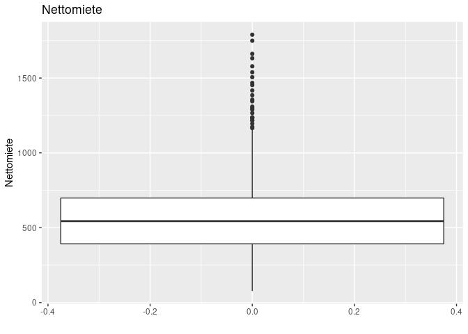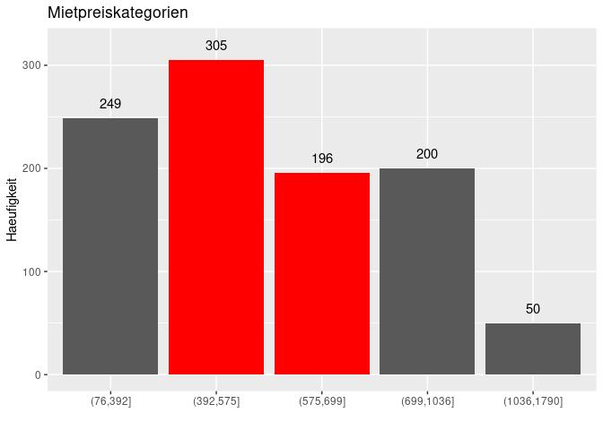

Grafik 1 (links) laesst eine symmetrische Verteilung der Nettomietpreise
mit einigen Ausreissern nach oben (Schwarze Punkte) erkennen. Grafik 2
(Mitte) gibt die Anzahl der Wohnungen in den entsprechenden
Nettomietenintervallen wider: 50.1% der Wohnungen hat einen Mietpreis
zwischen 392-699 und jeweils ein Viertel liegt darunter und darueber.
Die Intervallslaenge nimmt zu den Raendern hin deutlich waechst. Das
letzte Intervall, den teuersten 50 Wohnungen (5%), entspricht ungefaehr
der Zusammenlegung der ersten drei Intervalle (0-699). Grafik 3 (rechts)
die kumulierten Haeufigkeiten der Nettomietpreise wieder. Man kann
erkennen dass 55.4% der Wohnungen einen Nettomietpreis kleiner oder
gleich 575 haben.

### Wohnflaeche

Die durchschnittliche Wohnflaeche liegt bei: 71 Quadratmeter (qm).
Grafik 1 (links) deutet auf eine symmetrische Verteilung der Daten mit
einigen Ausreissern nach oben. Grafik 2 (Mitte) gibt die absoluten
Haeufigkeiten wieder. Die Anzahl der Wohnungen wird mit steigender
Flaeche immer kleiner. Weiters nimmt die Streuung zu den Raendern hin
immer mehr zu. 48.2% der Wohnungen sind auf das Intervall von 55-85 qm
konzentriert (in rot markierte Balken). Mehr wie die Haelfte (54%) der
Wohnungen haben eine Flaeche von 71 qm oder weniger (Grafik 3, rechts).

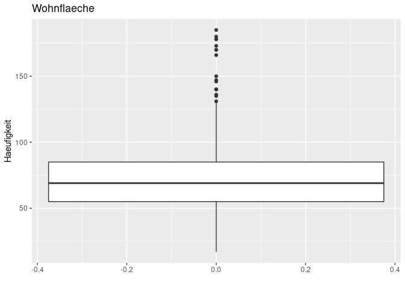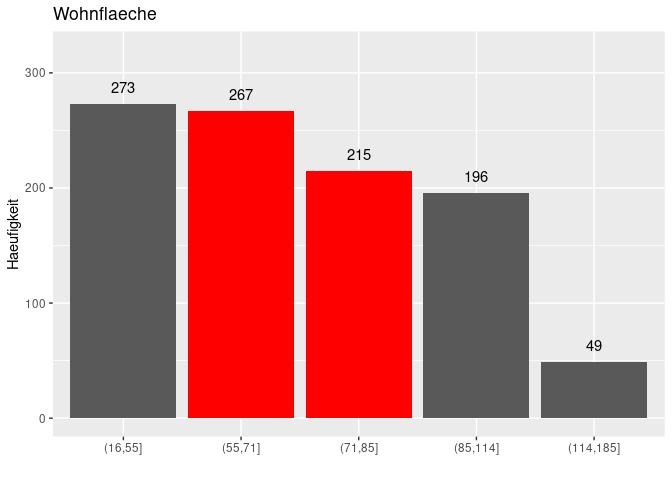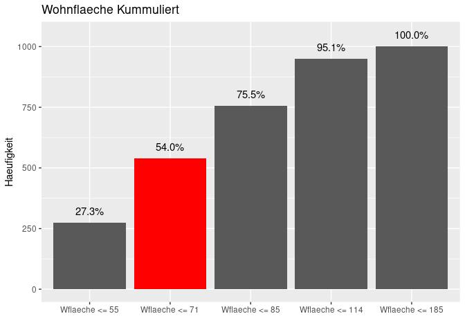

### Zimmer

71.2% der Wohnungen hat zwei oder drei Zimmer. Zu den Raendern hin nimmt
die Haeufigkeit stark ab (Grafik 1, links). Deutlich vor allem die
Anzahl der Wohnungen mit fuenf oder sechs Wohnungen macht 3.1 % der
gesamten Wohnungen aus. 82.4% der Wohnungen haben drei oder weniger
Zimmer (Grafik 2, rechts).

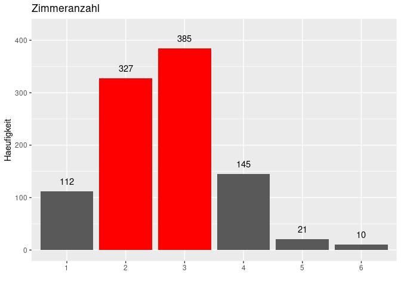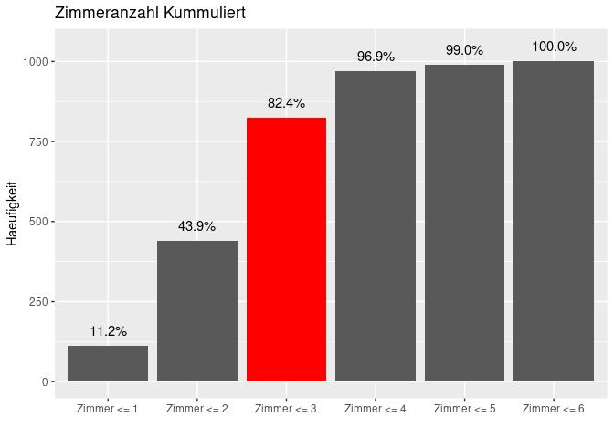

### Alter

Im Folgenden wird die Notation “80+” fuer all jene Wohnungen, die aelter
wie 80 Jahre sind, eingefuehrt. Es gab vor allem in der Zeit zwischen
dem ersten und zweitem Weltkrieg einen deutlichen Einbruch (40) an
Wohnungsbauten. Diesem folgte ein starker Anstieg in den
Nachkriegsjahren bis in die 80 Jahre hinein, wo sich der Wohnungsbau
stabilisierte. 76.1% aller Wohnungen sind in der Zeit nach dem Zweiten
Weltkrieg gebaut worden.

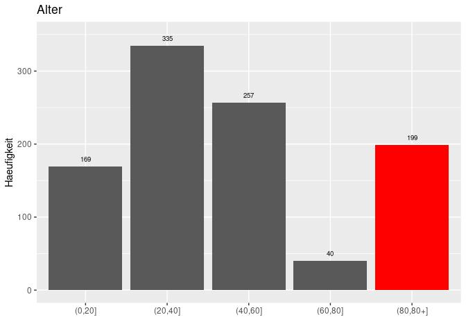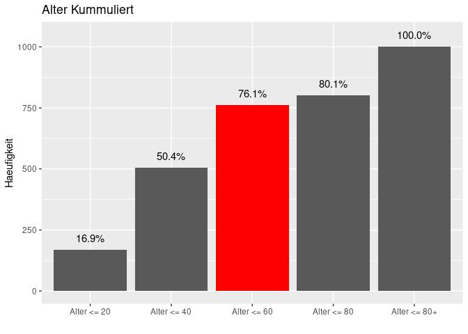

### Kategorische Variablen

Der Datensatz enthaelt zusaetzlich kategorische Variablen, deren
Haeufigkeiten in den folgenden Grafiken dargestellt werden. Fuer alle
folgenden Variablen lassen sich grosse Unterschiede in den Haeufigkeiten
feststellen.

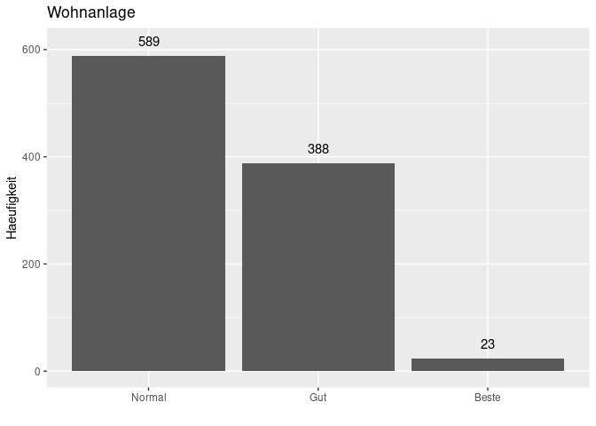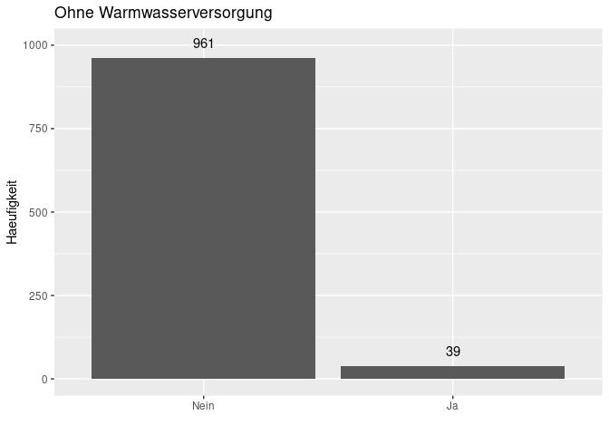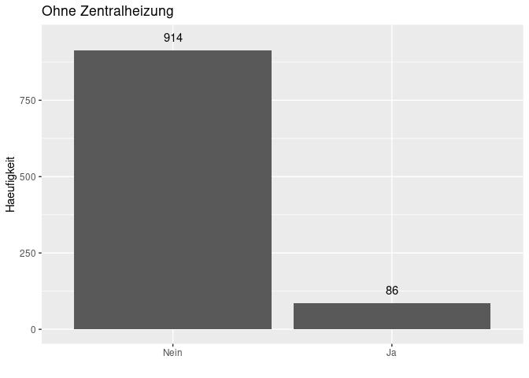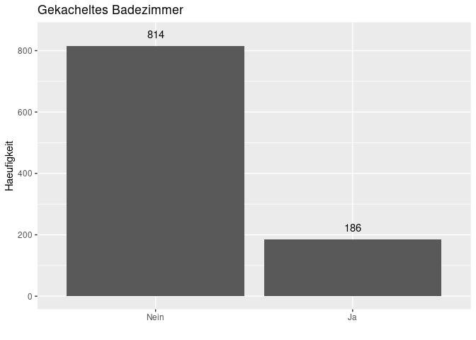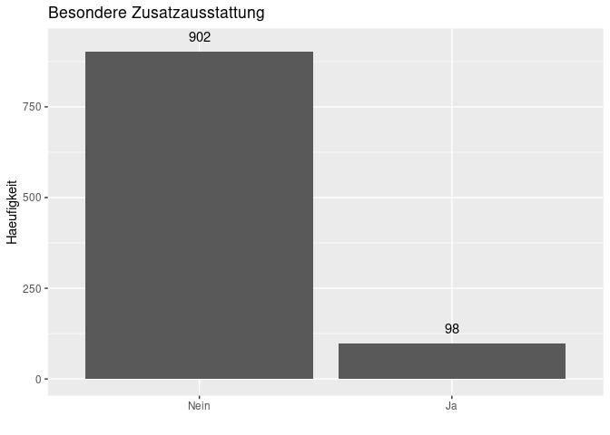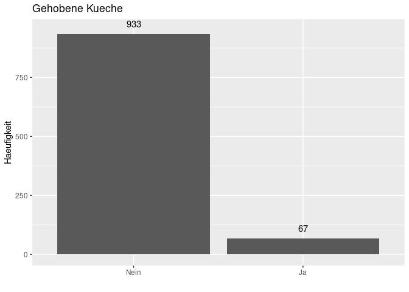

## Bivariate Analysen

Die unteren Grafik geben die Korrelationen der Variablen wieder. Die
linke Grafik enthaelt alle und die rechte Grafik nur die signifikanten
Korrelationen. Wie koennen beobachten: 1) Nettomiete ist mit fast allen
anderen Variablen signifikant korreliert. 2) Gehobene Kueche ist mit
keiner anderen Variablen signifikant korreliert. 3) Wohnflaeche und
Zimmeranzahl haben die staerkste- und Nettomiete und Wohnflaeche sind am
zweitstaerkste positive Korrelation.

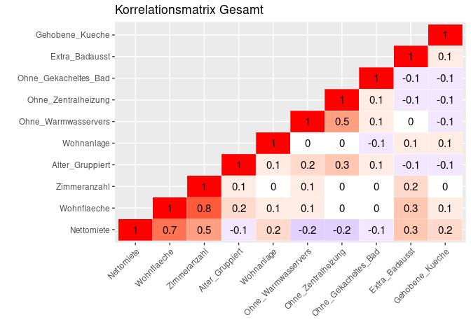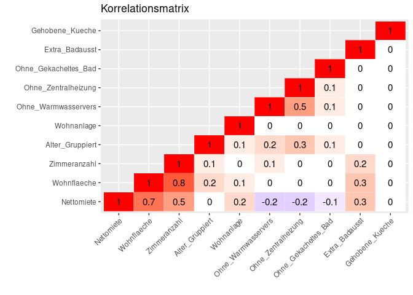

Im Folgenden wird der Zusammenhang zwischen der Nettomiete und
selektierten Variablen dargestellt. Mit steigender Wohnflaeche,
steigender Zimmeranzahl steigt die Nettomiete. Hier laesst sich jeweils
ein linearer Zusammenhang mit steigender Streuung noch oben beobachten.
Zwischen Alter und Nettomiete koennen wir einen nicht linearen
Zusammenhang beobachten. Konkret steigt die Nettomiete zu den Juengsten
(0 bis 20 Jahre) und den Aeltesten (80+).

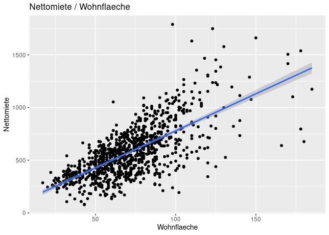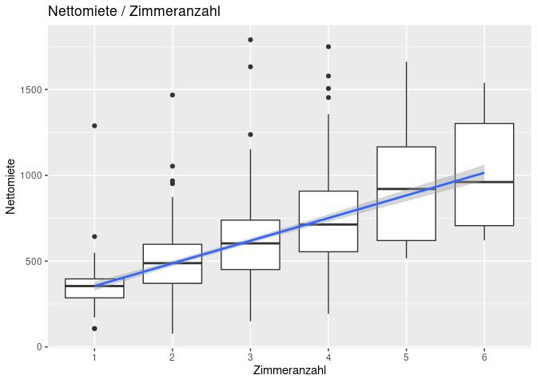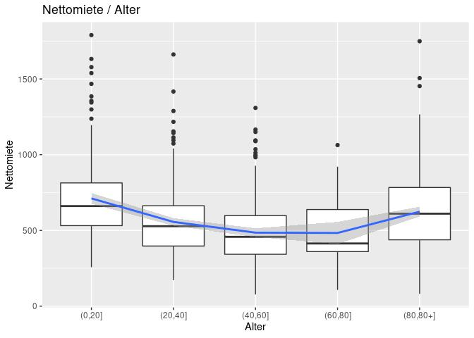

Im Folgenden wird fuer die restlichen Variablen die Nettomiete auf die
entsprechenden Auspraegungen dargestellt. In allen Faellen kann man
deutliche Unterschiede zwischen den Kategorien feststellen.

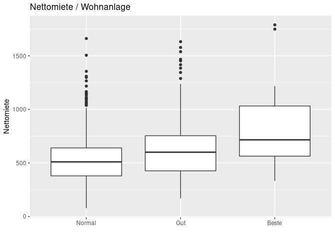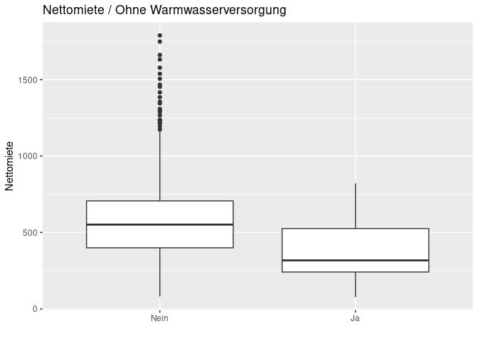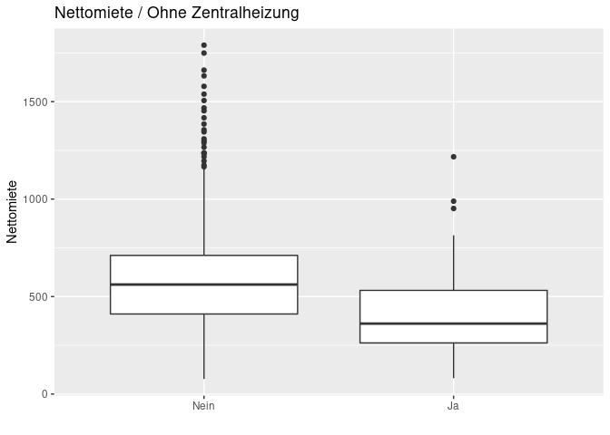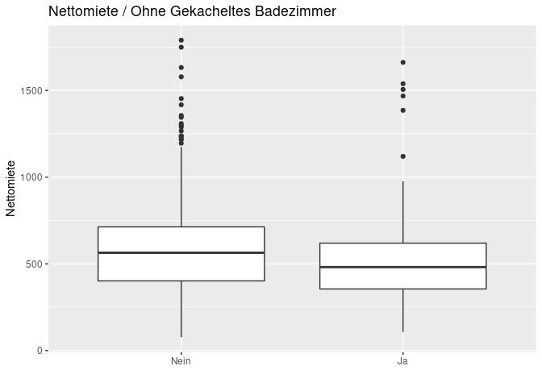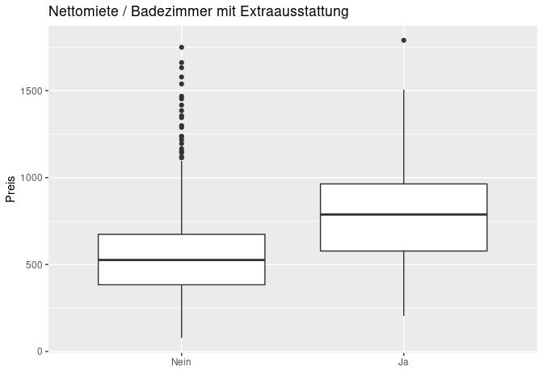

## Trivariate Analysen

Im Folgenden werden noch Zusammenhaenge zwischen dem Nettomietpreis und
jeweils zwei anderen Variablen dargestellt. Diese Darstellung
ermoeglicht eine differenzierte Betrachtung von Effekten die nur
zwischen zwei Variablen gleichzeitig aufkommen. Auffaellige unterschiede
konnten vor allem fuer die Variablen Wohnflaeche, Alter\_Gruppiert und
Wohnanlage festgestellt werden.

### Wohnflaeche +

Wir vermuten dass die Wohnflaeche der Massgebliche Treiber fuer den
Mietpreis darstellt und betrachten somit saemtliche Modelle wo die
Nettomiete durch die Wohnflaeche und noch einer weiteren Variablen
dargestellt werden. Die folgende Grafiken geben jeweils die
Regressionsgerade fuer die Wohnflaeche in Abhaengigkeit der zweiten
Variable wieder. Interessiert sind wir insbesondere an unterschiedlichen
Steigungen da diese als Indikator fuer Interaktionseffekte zwischen zwei
Variablen dienen. Die folgenden Grafiken geben die entsprechenden
Resultate wieder. Wir beobachten, dass die Nettiete bei Wohnflaeche und:

  - Wohnungen mit sechs Zimmern (a)
  - Wohnungen bis zu 20 Jahren (b)
  - in bester Lage (c)
  - mit Zentralheizung und (d)
  - mit Gehobener Kueche (e)

sich deutlich von anderen unterscheidet.

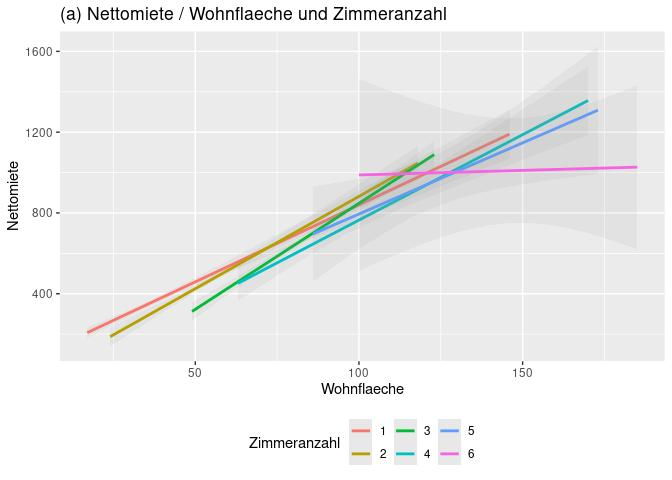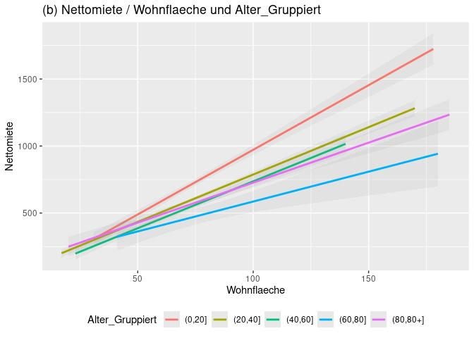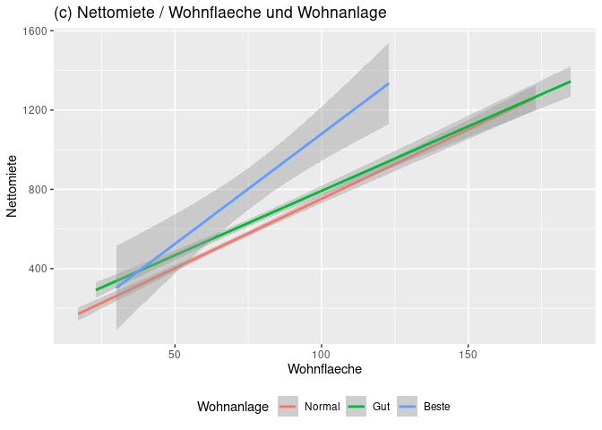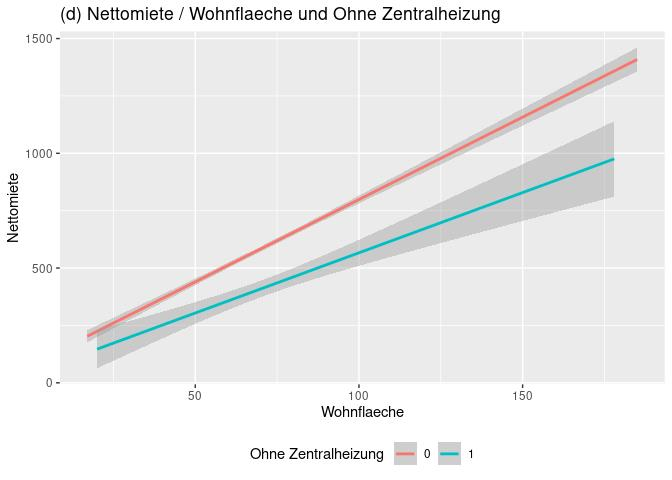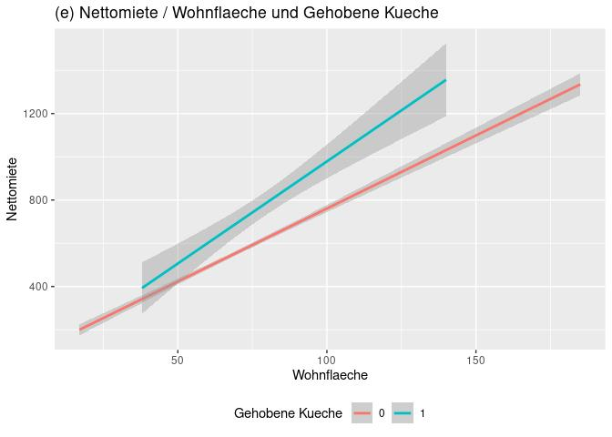

### Alter +

Die folgenden beiden Grafiken geben den Nettomietpreis fuer die
unterschiedlichen Altersklassen in Abhaengigkeit von der Zimmeranzahl
(a) und Gehobene Kueche (b) wieder. Fuer die Zimmeranzahl koennen wir
einen deutlichen unterschied zwischen sechs Zimmer Wohnungen bei bis zu
20 Jahre alten Wohnungen und anderen sechs Zimmer Wohnungen. Bei
Wohnungen mit gehobener Kueche faellt auf, dass im Vergleich zu
Wohnungen ohne gehobener Kueche der Nettomietpreis ueber die
Alterskategorieen konstant verlaeuft. Hier wirkt sich also das Alter
weniger stark auf den Mietpreis aus.

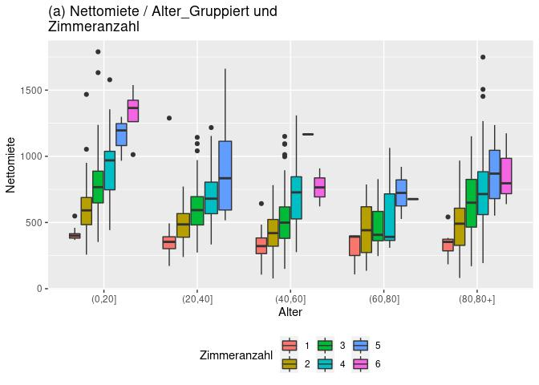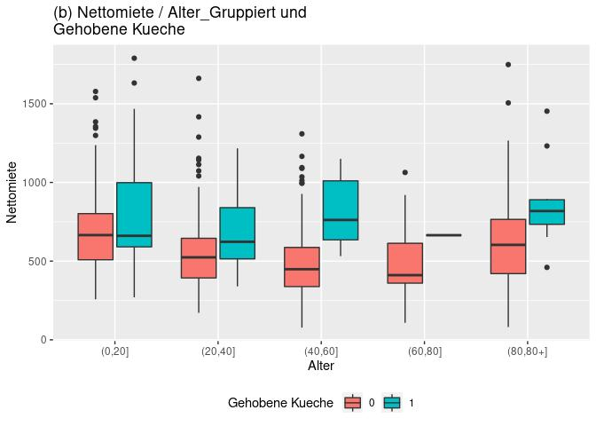

### Wohnanlage

Die folgende Grafik gibt die Nettomiete je Wohnanlage und Extra
Badausstattung wieder. Wie koennen erkennen, dass vor allem in der
besten Wohnanlage ein deutlich hoeherer Mietepreis fuer Wohnungen mit
Extra Badausstattung vorhanden ist wie fuer andere.

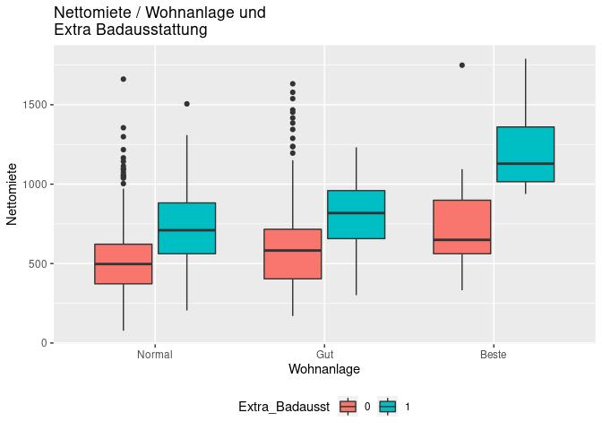

# Modellselektion

Bevor das eigentliche Modell geschaetzt wird, soll ein Entscheidungsbaum
uns weitere Auskuenfte ueber moegliche Zusammenhaenge geben.

## Entscheidungsbaum

Entscheidungsbaeume sind ein flexibeles Mittel, um klassenspezifische
Durchschnitte zu berechnen. Entscheidungsbaeume koennen aber zur
Variablenselektion verwendet werden, da sie eine Hierarchie der
wichtigsten Variablen erzeugen. Folgende Grafik gibt den
Entscheidungsbaum fuer diesen Datensatz wieder.

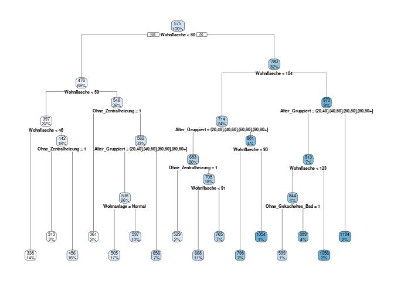

Die Grafik ist wie folgt zu verstehen: Auf oberster Ebene wird der
Mittelwert der Nettomiete 575 wiedergegeben. Dieser Enthaelt alle, d.h.
100% der Beobachtungen. Die groesste Varianzreduktion kann duch eine
Aufteilung der Wohnflaeche in Wohnungen die kleiner oder groesser wie 80
Quadratmeter (qm) sind erreicht werden. Der durchschnittliche
Nettomietpreis fuer Wohnungen die kleiner wie 80 qm sind ist 476 und
fuer Wohnungen die groesser wie 80 qm sind 780. Weitere Unterteilungen
folgen diesem Muster.

Wohnflaeche ist auf den ersten beiden Ebenen die Entscheidungsvariable.
Fuer Wohnungen unter 80 qm koennen wir beobachten, dass im Folgenden die
Variablen “Ohne Zentralheizung” und das gruppierte Alter zu weiteren
Entscheidungsvariablen werden. Fuer Wohnungen groesser gleich 80 qm
folgt in dritter Ebene das gruppierte Alter als Entscheidungsvariable,
wobei in Folgenden Ebenen Wohnflaeche wieder als Entscheidungsvariable
Auftaucht.

Zusammenfassend halten wir fest, dass die Wohnflaeche die dominanteste
Variable in der Erklaerung des Nettomietpreises ist. Fuer kleiner
Wohnungen ist dann die Variable Ohne\_Zentralheizung als
zweitdominanteste Variable. Fuer groesser Wohnungen sind ebenfalls die
Wohnflaeche und das Alter die dominanten Faktoren die den Nettomietpreis
erklaeren.

## Variablenselektion und Modifikation

Die hohe Korrelation zwischen Wohnflaeche und Zimmeranzahl (0.8) fuehrt
zu einem Schaetzproblem wenn beide Variablen zur Modellierung verwendet
werden. Konkret fuehrt eine Inklusion beider Variablen zu einem
positiven Zusammenhang zwischen Wohnflaeche und Nettomietpreis einen
negativen Zusammenhang zwischen Zimmeranzahl und Nettomietpreis. Da wir
bereits einen stark positiven Zusammenhang zwischen Zimmeranzahl und
Nettomietpreis beobachten konnten macht ein negativer Zusammenhang
inhaltlich keinen Sinn. Aufgrund der besseren Interpretierbarkeit, sowie
numerischer Eigenschaften, der Wohnflaeche wird diese stellvertretend
fuer beide Variablen fuer die Schaetzung verwendet. Ein weiterer Grund
liegt in der Eindeutigkeit der Wohnflaeche. Eine kleine Wohnung kann
auch mehrere Zimmer haben und eine grosse Wohnung kann nur wenige Zimmer
haben und ist somit nicht unbedingt eindeutig.

## Methode

Geschaetzt wird ein multivariates lineares Regressionsmodell. Die
Modellselektion erfolgt in einem Dreischrittverfahren. Im ersten Schritt
wird aufgrund der geringen Anzahl an Beobachtungen und Variablen die
Best Subset Methode zu Modellschaetzung verwendet. Im zweiten Schritt
werden wir das Modell aus der Best Subset Methode um die gemachten
Interaktionen ergaenzen. Wenn notwendig wird dann das Modell mit
Interaktionen dann noch “manuell” verfeinert.

### Best Subset

Das Best Subset Verfahren schaetzt jedes moegliche Modell aus den
vorhandenen Variablen ohne Interaktionen oder Transformationen und
selektiert aus allen das beste. Konkret werden zuerst alle Modelle mit
einer erklaerenden Variablen, dann alle mit zwei usw, bis letztendlich
das Modell mit allen erklaerenden Variablen gerechnet wird. In jeder
Stufe wird das beste Modell bestimmt. Zuletzt wird dann aus den besten
Modellen nochmals das Beste selektiert.

Das beste Modell ist jenes mit allen 8 erklaerenden Variablen. Fuer
dieses Modell erhalten wir einen angepassten
 Wert von 0.62.

### Best Subset Schaetzergebnis

Das Modell wird durch einen Breusch-Pagan-Test auf ungleiche Varianz
(Heteroskedastizitaet) geprueft. Das Ergebnis ist hochsignifikant was
als Indikator fuer ungleiche Varianzen verstanden wird. Diese fuehren zu
Verzerrungen in der Varianz des Schaetzers. Dieses Problem kann durch
eine heteroskedastizitaet konsistente Schaetzung, die im Folgenden fuer
alle weiteren Schaetzungen ebenfalls durchgefuehrt wird, behoben werden.
Die Ergebnisse werden in der folgenden Tabelle dargestellt:

### Interaktionen

Da Zimmeranzahl aus der weiteren Analyse bereits ausgeschlossen wurde,
bleiben aus der Trivariaten Analyse folgende Interaktionseffekte uebrig:

  - Wohnflaeche: Alter\_Gruppiert-, Wohnlage-, Ohne Zentralheizung und
    Gehobene Kueche
  - Alter: Gehobene Kueche
  - Wohnanlage und Extra Badausstattung

Im Folgenden werden wird das Best Subset Modell um diese Interaktionen
erweitert. Die nachstehende Tabelle gibt die signifikanten Variablen
wieder. Wir beobachten dass ausser den beiden Interaktionen zwischen
Wohnflaeche und Alter\_Grupperiert sowie Wohnflaeche und Wohnanlage
keine weiteren Interaktionenen signifikant sind. Allerdings sind nun
einige Variablen nicht mehr statistisch signifikant. Die folgende
Tabelle gibt die Resultate der Schaetzung wieder:

Das Modell hat einen adjustierten
 von 0.64.

### Anpassung

Im Vergleich beider Modelle erkennen wir, dass das Modell ohne
Interaktionen nicht alle Effekte beruecksichtigt und das Modell mit
allen relevanten Interaktionen zu unsinnigen Resultaten fuehrt. Wegen
der Best Subset Methode wissen wir, dass die individuellen Variablen
alle statistisch signifikant sind und sollten somit auch im Modell
enthalten sein. Bezueglich der Interaktionen werden wir uns auf jene
beschraenkten die im vorherigen Modell als Signifikant identifiziert
wurden. Die folgende Tabelle gibt die Werte wieder:

Bis auf die Variable Extra Badausstattung sind alle Variablen im Modell
enthalten sowie die beiden Interaktionsterme aus Wohnflaeche und
Alter\_Gruppiert sowie Alter\_Gruppiert und Gehobene Kueche. In diesem
Modell erhalten wir eine adjustierten
 von 0.62.

## Modell Selektion

Im Folgenden soll aus den drei Modellen eines anhand von gaengigen
Modellselektionskriterien ausgewaehlt werden. Als
Modellselektionskriterien werden der adjustierte
, das Akaike Informations Kriterium (AIC) sowie das Bayesianische
Informations Kriterium (BIC). Fuer den adjustierten
 gilt je hoeher desto besser und fuer die anderen beiden je
kleiner desto besser. Wir bevorzugen ein Modell einem anderen, wenn es
in mindestens zwei Kriterien besser ist wie das andere. Die folgende
Tabelle gibt die Ergebnisse der Kriterien wieder.

Die erste Zeile gibt die Ergebnisse fuer das Modell aus der Best Subset
Methode, also ohne Interaktionen wieder. In der zweiten Zeile die
Ergebnisse fuer das Modell mit den aus der Trivariaten Analyse
betrachteten Interaktionen und in der letzten Zeile das Modell mit den
signifikanten Interaktionen. Wir beobachten, dass das Modell mit
signifikanten Interaktionen von beiden anderen Modellen dominiert wird.
Wir koennen somit dieses Modell ausschliessen. Das Modell mit
Interaktionen macht aus bereits genannten gruenden ebenfalls fuer die
Modellierung keinen Sinn, da hier praktisch keine Variablen statistisch
signifikant sind. Daher waehlen wir das Best Subset Modell.

## Interpretation

Eine Wohnung hat einen Grundpreis von 168. Mit jedem Quadratmeter
Wohnflaeche steigt der Mietpreis um 7. Eine Wohnung die zwischen 20 und
40 Jahren alt ist, hat einen um 89 geringeren Mietpreis wie eine, die
bis 20 Jahre alt ist. Die Interpretation fuer die weiteren Variablen
folgt analog.

# Modell Analyse

## Homogene Varianzen

Schaetzt man ein lineares Modell mit ungleichen Varianzen in den
Fehlertermen, dann ist zwar der Schaetzer im noch erwartungstreu, aber
es gibt einen anderen mit geringerer Varianz. Somit testen wir im
folgenden, ob in diesem Modell die Fehler ungleiche Varianzen aufweisen.
Wenn ja, werden wir das selektierte Modell mit einem gewichteten
linearem Regressionsmodell vergleichen. Letzters sollte theoretisch zu
einer Varianzreduzierung fuehren.

Informell kann man die Varianzhomogenitaet testen indem die
Modellprognose gegen die Residuen geplottet werden. Sind die Fehler
konstant um eine Gerade ohne erkennbares Muster gestreut, gehen wir von
konstanten Varianzen aus. In der linken Grafik sind die Ergebnisse fuer
das normale Modell in der rechten fuer das gewichtete.

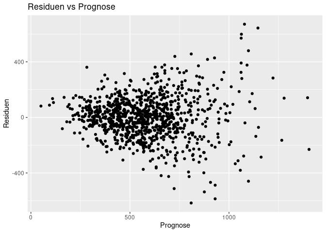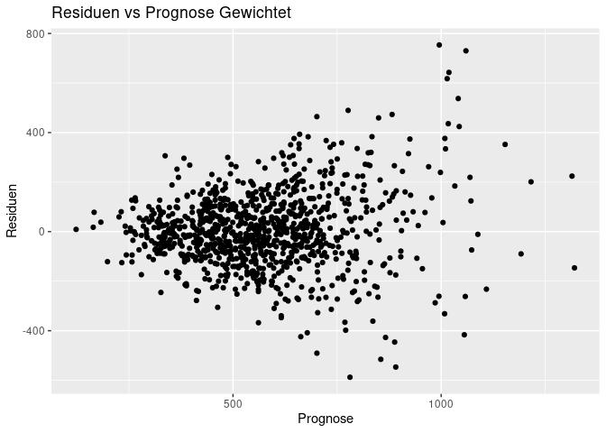

Wir erkennen keinen markanten Unterschied. Vergleichen wir die
Durchschnitte der quadrierten Residuen aus dem normalen Modell 22810 und
dem gewichteten 23351 erkennen wir, dass durch die Gewichtung sogar eine
verschlechterung erreicht wurde. Wir bleiben somit beim urspruenglichen
Modell.

## Ausreisser

Das Modell weist einige statistische Ausreisser auf. Grafik (a) und (b)
vergleicht die Residualplots der Modell mit (a) und ohne (b) Ausreisser.
Wir erkennen, dass in (b) die Residuen kreisfoermig um die Null auf der
y-Achse und ungefaehr den Mittelwert NA angeordnet sind. Grafik (c)
vergleicht die Modellparameter der Modelle mit und ohne Ausreisser. Am
staerksten wirken sich die Ausreisser auf die Variablen “Ohne
Warmwasserversorgung” und “Beste Wohnanlage” aus. Dennoch gibt es keine
offensichtliche Rechtfertigung, um die Ausreisser zu entfernen.

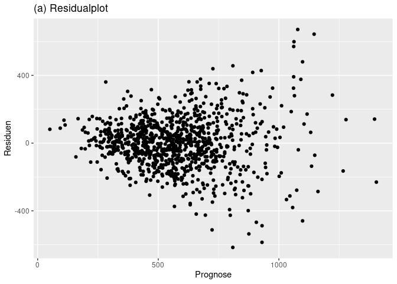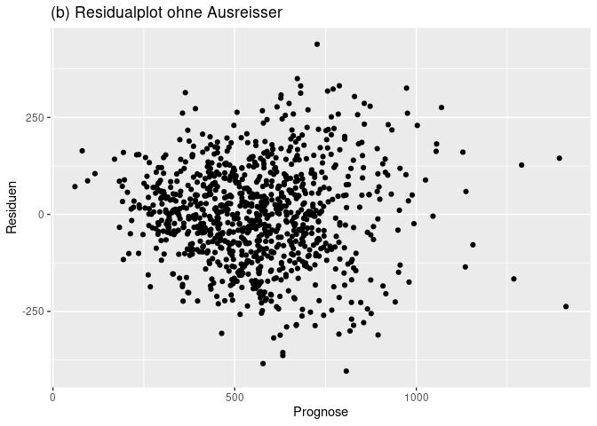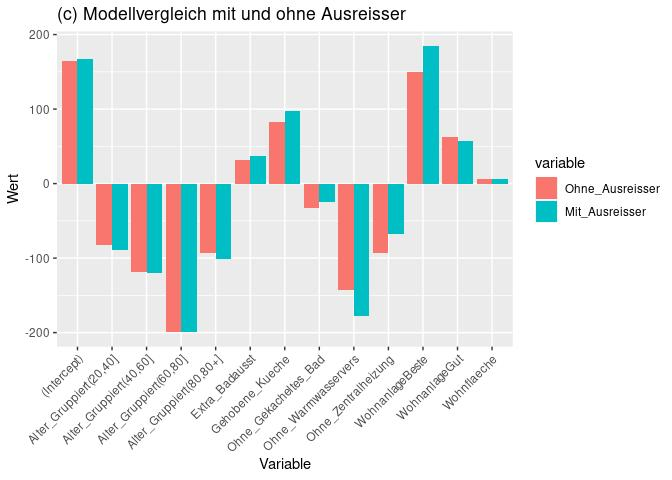

# Conclusio

Basierend auf der Datenanalyse und der Best Subset Methode wurden
verschiedene lineare Modelle mit unterschiedlicher Komplexitaet
geschaetzt. Ein Entscheidungsbaum hat uns zusaetzliche Informationen
ueber die hierarchische Struktur der Variablen gegeben. Hieraus konnten
wir deutlich entnehmen, dass Wohnflaeche die dominanteste Variable zur
Erklaerung des Nettomietpreises ist.

Anhand der Best Subset Methode wurde bewertet, welches lineare Modell
ohne Interaktionen oder weitere Variablentransformationen das beste ist.
Aus diesem Verfahren wurde ein Modell mit allen zur Verfuegung stehenden
erklaerenden Variablen gewaehlt. Dieses Modell wurde im naechsten
Schritt um einige aus der Trivariaten Analyse stammenden Interaktionen
ergaenzt. Dieses Modell hat einen hoeheren Erklaerungsgehalt, ist aber
fuer die Anwendung unbrauchbar, da nur ganz wenige Variablen statistisch
signifikant sind. Aus diesem Grund wurde noch ein Zusaetzliches Modell
mit nur den aus dem vorherigem Modell statistisch signifikanten
Interaktionen als Zusatz zum Best Subset Modell gerechnet. Dieses Modell
ist allerdings in seiner Prognoseguete schlechter als das Best Subset
Modell. Aus diesen Gruenden wurde das Best Subset Modell als finales
Modell gewaehlt.

Im letzten Schritt wurde das Modell auf Verletztung der
Varianzhomogenitaet sowie auf den Einfluss von Ausreissern getestet. Das
Modell weist ungleiche Varianzen in den Fehlern auf. Dieses Phaenomen
wirkt sich zwar nicht auf die Koeffizienten selber, sondern auf deren
Varianz, aus. In Konsequenz gibt es theoretisch einen anderen Schaetzer
mit geringerer Varianz. Diesen zu finden sollte durch ein gewichtetes
lineares Modell erreicht werden. In diesem Modell bekommen Beobachtungen
mit hoeherer Varianz eine geringere Gewichtung und tragen somit weniger
zum Ergebnis bei. Allerdings fuehrt dieses Modell zu einer hoeheren
Residuenvarianz womit auch dieses Verfahren verworfen wird. Nach dem
Cook’s Distance Kriterium wurden Ausreisser im Modell identifiziert. Im
Folgenden wurde das Best Subset Modell einmal mit und einmal ohne
Ausreisser gescheatzt und die Ergebnisse miteinander verglichen. Hier
kamen keine besonders auffaelligen Aenderungen im Modell zutage.
Wesentlicher ist allerdings, dass es keine offensichtliche Gruende gibt,
Ausreisser zu entfernen. Aus diesem Grund wurde auch hier zugunsten des
Modells mit Ausreissern entschieden.

Gegen anderweitige Transformationen von Variablen wie zB Berechnung von
Quadratmeterpreisen wurde aufgrund von Anwendungsgruenden
entgegenentschieden. Dieses Modell, so wie es ist, kann auf jede neue
Beobachtung der Form des Datensatzes direkt zur schaetzung des
Nettomietpreises verwendet werden.

Basierend auf allen gemachten Analysen wird sich zugunsten eines
linearen Regressionsmodell mit allen vorhandenen Variablen, exklusive
der Zimmeranzahl, ohne Interaktionen zur Erklaerung des Nettomietpreises
entschieden.
